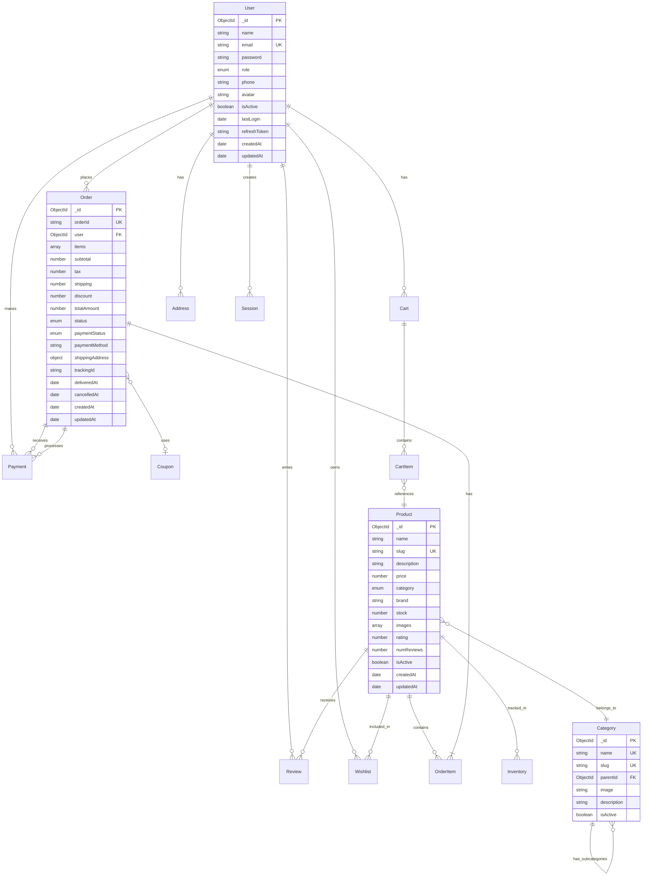

Yes, absolutely! Let me provide you with a **COMPLETE, ALL-IN-ONE Project Documentation** that covers **EVERY PART AND CONCEPT** you need. This is a **production-ready documentation package** that you can directly use for your Flipkart Clone project.

---

# 📚 **COMPLETE PROJECT DOCUMENTATION**

## Flipkart Clone - Enterprise E-commerce Platform (MERN + DevSecOps)

---

## 📑 **TABLE OF CONTENTS**

1. [Executive Summary](#1-executive-summary)
2. [System Requirements Specification](#2-system-requirements-specification)
3. [Architecture Design](#3-architecture-design)
4. [Database Design](#4-database-design)
5. [API Documentation](#5-api-documentation)
6. [User Interface Design](#6-user-interface-design)
7. [Security Architecture](#7-security-architecture)
8. [Testing Strategy](#8-testing-strategy)
9. [DevOps & Deployment](#9-devops--deployment)
10. [DevSecOps Integration](#10-devsecops-integration)
11. [Monitoring & Observability](#11-monitoring--observability)
12. [Disaster Recovery](#12-disaster-recovery)
13. [Compliance & Governance](#13-compliance--governance)
14. [Maintenance & Support](#14-maintenance--support)
15. [Team Structure](#15-team-structure)
16. [Cost Estimation](#16-cost-estimation)
17. [Timeline & Milestones](#17-timeline--milestones)
18. [Risk Management](#18-risk-management)
19. [Glossary](#19-glossary)

---

## 1. **EXECUTIVE SUMMARY**

### 1.1 Project Overview

```yaml
Project Name: Flipkart Clone - Enterprise E-commerce Platform
Version: 1.0.0
Type: Full-Stack Web Application
Architecture: Microservices + DevSecOps
Duration: 6 Months
Team Size: 8-12 Members
```

### 1.2 Business Objectives

| Objective        | Metric                        | Target             |
| ---------------- | ----------------------------- | ------------------ |
| User Acquisition | Registered Users              | 100,000+ in Year 1 |
| Revenue          | GMV (Gross Merchandise Value) | ₹50 Cr in Year 1   |
| Performance      | Page Load Time                | < 2 seconds        |
| Availability     | Uptime                        | 99.9%              |
| Conversion       | Add-to-Cart to Purchase       | 65%                |

### 1.3 Key Features

```
✅ User Management (Registration, Login, Profile)
✅ Product Catalog (Browse, Search, Filter, Sort)
✅ Shopping Cart (Add, Remove, Update Quantity)
✅ Order Management (Place, Track, Cancel, Return)
✅ Payment Integration (Cards, UPI, NetBanking, COD)
✅ Admin Dashboard (Product, Order, User Management)
✅ Review & Rating System
✅ Wishlist
✅ Coupons & Discounts
✅ AI-Powered Recommendations
✅ Real-time Order Tracking
✅ Multi-language Support
✅ Mobile Responsive Design
```

---

## 2. **SYSTEM REQUIREMENTS SPECIFICATION**

### 2.1 Functional Requirements (Detailed)

#### **Module 1: User Management (FR-01 to FR-08)**

| ID    | Requirement        | Input                        | Output                   | Priority |
| ----- | ------------------ | ---------------------------- | ------------------------ | -------- |
| FR-01 | User Registration  | name, email, password, phone | JWT token, user object   | High     |
| FR-02 | Email Verification | verification code            | Account activation       | High     |
| FR-03 | User Login         | email, password              | JWT token, refresh token | High     |
| FR-04 | Password Reset     | email                        | Reset link email         | High     |
| FR-05 | Social Login       | Google/Facebook token        | JWT token                | Medium   |
| FR-06 | Profile Management | user details                 | Updated profile          | Medium   |
| FR-07 | Address Management | address object               | Saved address            | Medium   |
| FR-08 | Two-Factor Auth    | OTP                          | Enhanced security        | Low      |

#### **Module 2: Product Management (FR-09 to FR-18)**

| ID    | Requirement          | Input                  | Output            | Priority |
| ----- | -------------------- | ---------------------- | ----------------- | -------- |
| FR-09 | Add Product          | product details        | Product created   | High     |
| FR-10 | Update Product       | product ID, updates    | Product updated   | High     |
| FR-11 | Delete Product       | product ID             | Product deleted   | High     |
| FR-12 | List Products        | filters, pagination    | Product array     | High     |
| FR-13 | Search Products      | search query           | Matching products | High     |
| FR-14 | Filter Products      | category, price, brand | Filtered products | High     |
| FR-15 | Sort Products        | sort field, order      | Sorted products   | Medium   |
| FR-16 | Bulk Upload          | CSV/Excel file         | Products created  | Medium   |
| FR-17 | Inventory Management | product ID, quantity   | Stock updated     | High     |
| FR-18 | Product Reviews      | rating, comment        | Review added      | Medium   |

#### **Module 3: Order Management (FR-19 to FR-28)**

| ID    | Requirement      | Input                     | Output           | Priority |
| ----- | ---------------- | ------------------------- | ---------------- | -------- |
| FR-19 | Add to Cart      | product ID, quantity      | Cart updated     | High     |
| FR-20 | View Cart        | user ID                   | Cart items       | High     |
| FR-21 | Update Cart      | product ID, quantity      | Cart updated     | High     |
| FR-22 | Remove from Cart | product ID                | Cart updated     | High     |
| FR-23 | Apply Coupon     | coupon code               | Discount applied | Medium   |
| FR-24 | Place Order      | shipping address, payment | Order created    | High     |
| FR-25 | Track Order      | order ID                  | Order status     | High     |
| FR-26 | Cancel Order     | order ID                  | Order cancelled  | High     |
| FR-27 | Return Order     | order ID, reason          | Return initiated | Medium   |
| FR-28 | Order History    | user ID                   | Order list       | High     |

#### **Module 4: Payment Integration (FR-29 to FR-35)**

| ID    | Requirement              | Input                     | Output              | Priority |
| ----- | ------------------------ | ------------------------- | ------------------- | -------- |
| FR-29 | Process Payment          | order ID, payment details | Transaction ID      | High     |
| FR-30 | Verify Payment           | payment ID, signature     | Verification status | High     |
| FR-31 | Refund Payment           | payment ID, amount        | Refund status       | Medium   |
| FR-32 | Save Payment Method      | card details              | Saved method        | Low      |
| FR-33 | Multiple Payment Methods | payment type              | Available methods   | High     |
| FR-34 | Payment Webhook          | payment event             | Status update       | High     |
| FR-35 | Payment Retry            | order ID                  | Retry payment       | Medium   |

#### **Module 5: Admin Dashboard (FR-36 to FR-45)**

| ID    | Requirement          | Description                    | Priority |
| ----- | -------------------- | ------------------------------ | -------- |
| FR-36 | Dashboard Overview   | Sales, orders, users summary   | High     |
| FR-37 | Order Management     | View, update, cancel orders    | High     |
| FR-38 | Product Management   | CRUD operations on products    | High     |
| FR-39 | User Management      | View, block, delete users      | High     |
| FR-40 | Inventory Management | Track stock, low stock alerts  | High     |
| FR-41 | Coupon Management    | Create, update, delete coupons | Medium   |
| FR-42 | Report Generation    | Sales, user, product reports   | Medium   |
| FR-43 | Analytics Dashboard  | Charts, trends, insights       | Medium   |
| FR-44 | System Settings      | Configure app settings         | Low      |
| FR-45 | Audit Logs           | View system activities         | Low      |

#### **Module 6: AI & Analytics (FR-46 to FR-52)**

| ID    | Requirement             | Description                           | Priority |
| ----- | ----------------------- | ------------------------------------- | -------- |
| FR-46 | Product Recommendations | AI-based personalized suggestions     | Medium   |
| FR-47 | Search Optimization     | Smart search with spelling correction | Medium   |
| FR-48 | Price Prediction        | Dynamic pricing based on demand       | Low      |
| FR-49 | Customer Segmentation   | Group users based on behavior         | Medium   |
| FR-50 | Fraud Detection         | Identify suspicious transactions      | High     |
| FR-51 | Sentiment Analysis      | Analyze reviews for insights          | Low      |
| FR-52 | Chatbot                 | AI-powered customer support           | Medium   |

### 2.2 Non-Functional Requirements

#### **Performance Requirements**

```yaml
Response Times:
  - API Response (P95): < 200ms
  - Page Load Time: < 2 seconds
  - Search Results: < 500ms
  - Checkout Process: < 3 seconds
  - Database Query: < 100ms

Throughput:
  - Concurrent Users: 10,000+
  - Requests Per Second: 5,000+
  - Orders Per Minute: 1,000+
  - Search Queries Per Second: 2,000+

Resource Utilization:
  - CPU Usage: < 70%
  - Memory Usage: < 80%
  - Disk I/O: < 80%
  - Network Bandwidth: < 70%
```

#### **Availability Requirements**

```yaml
Uptime:
  - Production: 99.9% (8.76 hours downtime/year)
  - Staging: 99.5% (43.8 hours downtime/year)
  - Development: 99% (87.6 hours downtime/year)

Maintenance Windows:
  - Scheduled: Sundays 2 AM - 4 AM IST
  - Emergency: As needed with 1 hour notice
  - Duration: Maximum 2 hours

Disaster Recovery:
  - RTO (Recovery Time Objective): 15 minutes
  - RPO (Recovery Point Objective): 5 minutes
  - Backup Frequency: Every 6 hours
```

#### **Security Requirements**

```yaml
Authentication:
  - Password Policy: Min 8 chars, 1 uppercase, 1 number, 1 special
  - Session Timeout: 15 minutes inactivity
  - Max Login Attempts: 5 (then 30 min lockout)
  - MFA: Optional for users, mandatory for admins

Authorization:
  - Role-Based Access Control (RBAC)
  - Principle of Least Privilege
  - Regular Access Reviews (Quarterly)

Data Protection:
  - Encryption at Rest: AES-256
  - Encryption in Transit: TLS 1.3
  - Sensitive Data: Tokenization/Pseudonymization
  - PII Data: GDPR compliant storage

Security Testing:
  - SAST: Every commit
  - DAST: Daily automated scans
  - Penetration Testing: Quarterly
  - Vulnerability Scanning: Weekly
```

#### **Scalability Requirements**

```yaml
Horizontal Scaling:
  - Application: Auto-scaling based on CPU (70%)
  - Database: Sharding at 500GB
  - Cache: Cluster mode at 10GB

Vertical Scaling:
  - Application Pods: Max 20 replicas
  - Database: Max 100GB storage
  - Cache: Max 50GB memory

Auto-scaling Triggers:
  - CPU > 70% for 2 minutes
  - Memory > 80% for 2 minutes
  - Request rate > 1000/sec
  - Queue length > 1000
```

### 2.3 Technical Requirements

#### **Development Environment**

```yaml
Operating Systems:
  - Development: Windows 11 / macOS 12+ / Ubuntu 20.04+
  - Production: Amazon Linux 2 / Ubuntu 22.04

Software Requirements:
  - Node.js: v18.x or higher
  - MongoDB: v6.x
  - Redis: v7.x
  - Docker: v24.x
  - Kubernetes: v1.27+
  - Git: v2.40+

Hardware Requirements (Development):
  - CPU: 4+ cores
  - RAM: 16+ GB
  - Storage: 50+ GB SSD
  - Network: 50+ Mbps

Hardware Requirements (Production Minimum):
  - CPU: 8+ cores
  - RAM: 32+ GB
  - Storage: 200+ GB SSD
  - Network: 100+ Mbps
```

#### **Third-Party Services**

| Service       | Purpose          | Provider  | Cost (Monthly)     |
| ------------- | ---------------- | --------- | ------------------ |
| Cloud Hosting | Infrastructure   | AWS/GCP   | $500-1000          |
| Database      | MongoDB Atlas    | MongoDB   | $300-500           |
| Cache         | Redis Enterprise | Redis     | $200-300           |
| CDN           | CloudFront       | AWS       | $100-200           |
| Email         | SendGrid         | Twilio    | $50-100            |
| SMS           | Twilio           | Twilio    | $50-100            |
| Payment       | Razorpay         | Razorpay  | 2% per transaction |
| AI            | OpenAI           | OpenAI    | $100-500           |
| Monitoring    | New Relic        | New Relic | $200-300           |
| Logging       | ELK Cloud        | Elastic   | $150-250           |

---

## 3. **ARCHITECTURE DESIGN**

### 3.1 High-Level Architecture Diagram

```
┌─────────────────────────────────────────────────────────────────────────────────┐
│                              CLIENT LAYER                                        │
│  ┌──────────────┐  ┌──────────────┐  ┌──────────────┐  ┌──────────────┐        │
│  │   Web App    │  │ Mobile App   │  │   Admin      │  │   Third      │        │
│  │   (React)    │  │ (React Native)│  │  Dashboard   │  │   Party      │        │
│  └──────┬───────┘  └──────┬───────┘  └──────┬───────┘  └──────┬───────┘        │
│         │                 │                 │                 │                │
│         └─────────────────┴─────────────────┴─────────────────┘                │
│                                      │                                           │
│                                      ▼ (HTTPS/WSS)                              │
│  ┌───────────────────────────────────────────────────────────────────────────┐  │
│  │                         CDN (CloudFront)                                   │  │
│  │                    Static Assets, Images, Videos                          │  │
│  └───────────────────────────────────────────────────────────────────────────┘  │
│                                      │                                           │
│  ┌───────────────────────────────────────────────────────────────────────────┐  │
│  │                    LOAD BALANCER (AWS ALB / NGINX)                        │  │
│  │              SSL Termination, Rate Limiting, Health Checks                │  │
│  └───────────────────────────────────────────────────────────────────────────┘  │
└─────────────────────────────────────────────────────────────────────────────────┘
                                               │
┌─────────────────────────────────────────────────────────────────────────────────┐
│                          APPLICATION LAYER (Kubernetes)                         │
│                                                                                  │
│  ┌────────────────────────────────────────────────────────────────────────────┐ │
│  │                          API GATEWAY (Express Gateway)                     │ │
│  │                    Authentication, Routing, Aggregation                     │ │
│  └────────┬──────────────┬──────────────┬──────────────┬─────────────────────┘ │
│           │              │              │              │                        │
│           ▼              ▼              ▼              ▼                        │
│  ┌────────────────┐ ┌────────────────┐ ┌────────────────┐ ┌────────────────┐   │
│  │ Auth Service   │ │ Product        │ │ Order          │ │ Payment        │   │
│  │ (Node.js)      │ │ Service        │ │ Service        │ │ Service        │   │
│  │ 3 replicas     │ │ (Node.js)      │ │ (Node.js)      │ │ (Node.js)      │   │
│  │ Port: 3001     │ │ 5 replicas     │ │ 3 replicas     │ │ 2 replicas     │   │
│  │                │ │ Port: 3002     │ │ Port: 3003     │ │ Port: 3004     │   │
│  └────────────────┘ └────────────────┘ └────────────────┘ └────────────────┘   │
│                                                                                  │
│  ┌────────────────┐ ┌────────────────┐ ┌────────────────┐ ┌────────────────┐   │
│  │ Cart Service   │ │ Search         │ │ AI Service     │ │ Notification   │   │
│  │ (Node.js)      │ │ Service        │ │ (Python/OpenAI)│ │ Service        │   │
│  │ 2 replicas     │ │ (Elasticsearch)│ │ 1 replica      │ │ (Node.js)      │   │
│  │ Port: 3005     │ │ Port: 9200     │ │ Port: 3007     │ │ 2 replicas     │   │
│  │                │ │                │ │                │ │ Port: 3008     │   │
│  └────────────────┘ └────────────────┘ └────────────────┘ └────────────────┘   │
│                                                                                  │
│  ┌────────────────────────────────────────────────────────────────────────────┐ │
│  │                    MESSAGE QUEUE (Redis / Bull)                            │ │
│  │          Email Queue | Order Queue | Report Queue | SMS Queue              │ │
│  └────────────────────────────────────────────────────────────────────────────┘ │
└─────────────────────────────────────────────────────────────────────────────────┘
                                               │
┌─────────────────────────────────────────────────────────────────────────────────┐
│                              DATA LAYER                                          │
│                                                                                  │
│  ┌────────────────┐ ┌────────────────┐ ┌────────────────┐ ┌────────────────┐   │
│  │    MongoDB     │ │     Redis      │ │ Elasticsearch  │ │      S3        │   │
│  │   Primary      │ │    Cache       │ │    Search      │ │    Images      │   │
│  │   Cluster      │ │    Cluster     │ │    Cluster     │ │    Storage     │   │
│  │                │ │                │ │                │ │                │   │
│  │  • 3 nodes     │ │  • 3 nodes     │ │  • 3 nodes     │ │  • CDN enabled │   │
│  │  • Replica set │ │  • Sentinel    │ │  • Replica     │ │  • Lifecycle   │   │
│  │  • 100GB SSD   │ │  • 10GB RAM    │ │  • 50GB SSD    │ │  • Versioning  │   │
│  └────────────────┘ └────────────────┘ └────────────────┘ └────────────────┘   │
│                                                                                  │
│  ┌────────────────┐ ┌────────────────┐ ┌────────────────┐                       │
│  │    Backup      │ │    Data        │ │    Analytics   │                       │
│  │    S3          │ │    Warehouse   │ │    Database    │                       │
│  │                │ │    (Redshift)  │ │    (ClickHouse)│                       │
│  │  • Daily       │ │  • ETL daily   │ │  • Real-time   │                       │
│  │  • Encrypted   │ │  • Historical  │ │  • Aggregated  │                       │
│  │  • 30 days     │ │  • 5 years     │ │  • 30 seconds  │                       │
│  └────────────────┘ └────────────────┘ └────────────────┘                       │
└─────────────────────────────────────────────────────────────────────────────────┘
                                               │
┌─────────────────────────────────────────────────────────────────────────────────┐
│                         OBSERVABILITY LAYER                                      │
│                                                                                  │
│  ┌────────────────┐ ┌────────────────┐ ┌────────────────┐ ┌────────────────┐   │
│  │   Prometheus   │ │    Grafana     │ │      ELK       │ │    Jaeger      │   │
│  │   Metrics      │ │  Dashboards    │ │     Logs       │ │   Tracing      │   │
│  │                │ │                │ │                │ │                │   │
│  │  • 30s scrape  │ │  • Custom      │ │  • Centralized │ │  • Distributed │   │
│  │  • Retention   │ │  • Alerts      │ │  • Searchable  │ │  • Performance │   │
│  │  • 15 days     │ │  • Annotations │ │  • 30 days     │ │  • Sampling    │   │
│  └────────────────┘ └────────────────┘ └────────────────┘ └────────────────┘   │
└─────────────────────────────────────────────────────────────────────────────────┘
```

### 3.2 Microservices Architecture

```yaml
Service Discovery:
  Tool: Consul / Eureka
  Pattern: Client-side discovery
  Health Checks: Every 30 seconds

API Gateway:
  Tool: Express Gateway / Kong
  Features:
    - Rate limiting: 100 req/min per user
    - Request/Response transformation
    - Circuit breaker
    - Request logging
    - JWT validation

Service Communication:
  Synchronous: REST (HTTP/2) / gRPC
  Asynchronous: Message Queue (Redis Bull)
  Event-Driven: Kafka (for analytics)

Service Mesh:
  Tool: Istio / Linkerd
  Features:
    - mTLS encryption
    - Traffic splitting
    - Circuit breaking
    - Retry logic
    - Timeout configuration
```

### 3.3 Deployment Architecture

```yaml
Environment: AWS (ap-south-1 - Mumbai)
Orchestration: Amazon EKS (Kubernetes)

Cluster Configuration:
  Version: 1.27
  Node Groups:
    - Name: general
      Instance: t3.large
      Min: 3, Max: 10
      Use: API services

    - Name: memory-optimized
      Instance: r5.large
      Min: 2, Max: 5
      Use: Database, Cache

    - Name: compute-optimized
      Instance: c5.large
      Min: 2, Max: 8
      Use: Search, ML workloads

Networking:
  VPC CIDR: 10.0.0.0/16
  Public Subnets: 3 (for load balancers)
  Private Subnets: 3 (for application)
  Isolated Subnets: 3 (for databases)

Storage:
  Persistent Volumes: EBS (gp3)
  Shared Storage: EFS
  Object Storage: S3

Ingress:
  Controller: AWS Load Balancer Controller
  SSL: AWS Certificate Manager
  WAF: AWS WAF with OWASP rules
  CDN: CloudFront
```

---

## 4. **DATABASE DESIGN**

### 4.1 Complete ER Diagram



### 4.2 Database Indexing Strategy

```javascript
// Users Collection Indexes
db.users.createIndex({ email: 1 }, { unique: true });
db.users.createIndex({ createdAt: -1 });
db.users.createIndex({ role: 1, isActive: 1 });

// Products Collection Indexes
db.products.createIndex({ name: "text", description: "text" });
db.products.createIndex({ category: 1, price: -1 });
db.products.createIndex({ slug: 1 }, { unique: true });
db.products.createIndex({ rating: -1 });
db.products.createIndex({ createdAt: -1 });
db.products.createIndex({ brand: 1, category: 1 });

// Orders Collection Indexes
db.orders.createIndex({ user: 1, createdAt: -1 });
db.orders.createIndex({ orderId: 1 }, { unique: true });
db.orders.createIndex({ status: 1, paymentStatus: 1 });
db.orders.createIndex({ createdAt: 1 }, { expireAfterSeconds: 7776000 }); // 90 days

// Reviews Collection Indexes
db.reviews.createIndex({ product: 1, createdAt: -1 });
db.reviews.createIndex({ user: 1, product: 1 }, { unique: true });

// Cart Collection Indexes
db.cart.createIndex({ user: 1 }, { unique: true });
db.cart.createIndex({ expiresAt: 1 }, { expireAfterSeconds: 0 });

// Sessions Collection Indexes
db.sessions.createIndex({ token: 1 }, { unique: true });
db.sessions.createIndex({ expiresAt: 1 }, { expireAfterSeconds: 0 });
```

### 4.3 Data Migration Strategy

```yaml
Migration Tool: MongoDB Migrations (migrate-mongo)

Migration Types:
  - Schema Changes: Rolling updates (backward compatible)
  - Data Migrations: Batch processing (1000 docs/batch)
  - Index Creation: Background mode (non-blocking)

Rollback Strategy:
  - Version-controlled migrations
  - Down migrations for each change
  - Backup before migration

Migration Process: 1. Create backup
  2. Run in staging
  3. Verify data integrity
  4. Run in production (off-peak hours)
  5. Monitor for errors
  6. Ready for rollback if needed
```

---

## 5. **API DOCUMENTATION**

### 5.1 API Standards

```yaml
Base URL: https://api.flipkart-clone.com/v1
Version: v1 (major), v1.2.0 (minor)
Format: JSON
Encoding: UTF-8
Date Format: ISO 8601 (YYYY-MM-DDThh:mm:ssZ)

Authentication:
  Type: Bearer JWT
  Header: Authorization: Bearer <token>
  Token Expiry: 15 minutes (access), 7 days (refresh)

Rate Limiting:
  Default: 100 requests/minute
  Authenticated: 500 requests/minute
  Admin: 1000 requests/minute
  Response Headers:
    - X-RateLimit-Limit
    - X-RateLimit-Remaining
    - X-RateLimit-Reset

Pagination:
  Parameter: page (default: 1), limit (default: 20, max: 100)
  Response Headers:
    - X-Total-Count
    - X-Total-Pages
    - Link (RFC 5988)

Error Responses:
  Format:
    {
      "success": false,
      "error": {
        "code": "ERROR_CODE",
        "message": "Human readable message",
        "details": {},
        "timestamp": "2024-01-01T00:00:00Z"
      }
    }

  HTTP Status Codes:
    200: Success
    201: Created
    400: Bad Request
    401: Unauthorized
    403: Forbidden
    404: Not Found
    429: Too Many Requests
    500: Internal Server Error
```

### 5.2 Complete API Endpoints

#### **Authentication Module**

```yaml
POST /auth/register
  Description: Register new user
  Body:
    name: string (required, min:2, max:50)
    email: string (required, email format)
    password: string (required, min:8, strong)
    phone: string (optional, 10 digits)
  Response: 201
    {
      "success": true,
      "data": {
        "user": { ... },
        "token": "jwt_token",
        "refreshToken": "refresh_token"
      }
    }

POST /auth/login
  Description: Authenticate user
  Body:
    email: string (required)
    password: string (required)
  Response: 200
    {
      "success": true,
      "data": {
        "user": { ... },
        "token": "jwt_token",
        "refreshToken": "refresh_token"
      }
    }

POST /auth/logout
  Description: Logout user
  Headers: Authorization: Bearer <token>
  Response: 200
    {
      "success": true,
      "message": "Logged out successfully"
    }

POST /auth/refresh
  Description: Refresh access token
  Body:
    refreshToken: string (required)
  Response: 200
    {
      "success": true,
      "data": {
        "token": "new_jwt_token"
      }
    }

POST /auth/forgot-password
  Description: Send password reset email
  Body:
    email: string (required)
  Response: 200
    {
      "success": true,
      "message": "Reset email sent"
    }

POST /auth/reset-password
  Description: Reset password
  Body:
    token: string (required)
    password: string (required)
  Response: 200
    {
      "success": true,
      "message": "Password reset successful"
    }
```

#### **Product Module**

```yaml
GET /products
  Description: Get all products with filters
  Query Parameters:
    page: number (default: 1)
    limit: number (default: 20, max: 100)
    category: string (Electronics|Fashion|Books|Home|Toys)
    minPrice: number
    maxPrice: number
    brand: string
    rating: number (1-5)
    sort: string (price|rating|newest)
    order: string (asc|desc)
    search: string
  Response: 200
    {
      "success": true,
      "data": {
        "products": [ ... ],
        "pagination": {
          "page": 1,
          "limit": 20,
          "total": 150,
          "pages": 8
        },
        "filters": {
          "categories": [...],
          "brands": [...],
          "priceRange": { "min": 100, "max": 100000 }
        }
      }
    }

GET /products/:id
  Description: Get product by ID
  Parameters:
    id: string (required)
  Response: 200
    {
      "success": true,
      "data": {
        "_id": "656a3b8c...",
        "name": "iPhone 14",
        "price": 69999,
        "description": "...",
        "category": "Electronics",
        "brand": "Apple",
        "stock": 50,
        "images": ["url1", "url2"],
        "rating": 4.5,
        "reviews": [...]
      }
    }

POST /products (Admin only)
  Description: Create new product
  Headers: Authorization: Bearer <admin_token>
  Body:
    name: string (required)
    price: number (required, min:0)
    description: string (required)
    category: string (required)
    brand: string
    stock: number (required, min:0)
    images: array
  Response: 201
    {
      "success": true,
      "data": { ... }
    }

PUT /products/:id (Admin only)
  Description: Update product
  Headers: Authorization: Bearer <admin_token>
  Body:
    (any product fields)
  Response: 200
    {
      "success": true,
      "data": { ... }
    }

DELETE /products/:id (Admin only)
  Description: Delete product
  Headers: Authorization: Bearer <admin_token>
  Response: 200
    {
      "success": true,
      "message": "Product deleted"
    }

GET /products/search
  Description: Search products with AI
  Query Parameters:
    q: string (required)
    limit: number (default: 10)
  Response: 200
    {
      "success": true,
      "data": {
        "query": "iphone",
        "suggestions": ["iPhone 14", "iPhone 13"],
        "results": [...],
        "didYouMean": "iPhone"
      }
    }
```

#### **Cart Module**

```yaml
GET /cart
  Description: Get user cart
  Headers: Authorization: Bearer <token>
  Response: 200
    {
      "success": true,
      "data": {
        "items": [
          {
            "product": { ... },
            "quantity": 2,
            "price": 69999,
            "total": 139998
          }
        ],
        "subtotal": 139998,
        "tax": 25199.64,
        "total": 165197.64
      }
    }

POST /cart/add
  Description: Add item to cart
  Headers: Authorization: Bearer <token>
  Body:
    productId: string (required)
    quantity: number (required, min:1, max:10)
  Response: 200
    {
      "success": true,
      "data": { ... }
    }

PUT /cart/update
  Description: Update cart item quantity
  Headers: Authorization: Bearer <token>
  Body:
    productId: string (required)
    quantity: number (required, min:0)
  Response: 200
    {
      "success": true,
      "data": { ... }
    }

DELETE /cart/remove/:productId
  Description: Remove item from cart
  Headers: Authorization: Bearer <token>
  Response: 200
    {
      "success": true,
      "message": "Item removed"
    }

DELETE /cart/clear
  Description: Clear entire cart
  Headers: Authorization: Bearer <token>
  Response: 200
    {
      "success": true,
      "message": "Cart cleared"
    }
```

#### **Order Module**

```yaml
POST /orders
  Description: Create new order
  Headers: Authorization: Bearer <token>
  Body:
    shippingAddress: {
      street: string (required),
      city: string (required),
      state: string (required),
      pincode: string (required, 6 digits),
      country: string (required)
    }
    paymentMethod: string (required, COD|Card|UPI|NetBanking)
    couponCode: string (optional)
  Response: 201
    {
      "success": true,
      "data": {
        "orderId": "ORD1702234567890ABC",
        "items": [...],
        "totalAmount": 82498.82,
        "status": "pending",
        "paymentIntent": {
          "clientSecret": "pi_3Nqwertyuiop123456_secret_xyz"
        }
      }
    }

GET /orders/myorders
  Description: Get user's orders
  Headers: Authorization: Bearer <token>
  Query Parameters:
    page: number (default: 1)
    limit: number (default: 10)
    status: string (optional)
  Response: 200
    {
      "success": true,
      "data": {
        "orders": [...],
        "pagination": { ... }
      }
    }

GET /orders/:id
  Description: Get order details
  Headers: Authorization: Bearer <token>
  Response: 200
    {
      "success": true,
      "data": {
        "orderId": "...",
        "items": [...],
        "shippingAddress": {...},
        "paymentDetails": {...},
        "status": "confirmed",
        "trackingId": "TRK123456",
        "timeline": [
          { "status": "Order Placed", "timestamp": "2024-01-01T10:00:00Z" },
          { "status": "Confirmed", "timestamp": "2024-01-01T10:05:00Z" },
          { "status": "Shipped", "timestamp": "2024-01-01T14:00:00Z" }
        ]
      }
    }

PUT /orders/:id/cancel
  Description: Cancel order
  Headers: Authorization: Bearer <token>
  Body:
    reason: string (optional)
  Response: 200
    {
      "success": true,
      "message": "Order cancelled",
      "data": {
        "refundAmount": 82498.82,
        "refundStatus": "processing"
      }
    }
```

#### **Payment Module**

```yaml
POST /payments/initiate
  Description: Initiate payment
  Headers: Authorization: Bearer <token>
  Body:
    orderId: string (required)
    paymentMethod: string (required)
  Response: 200
    {
      "success": true,
      "data": {
        "paymentId": "pay_123456",
        "orderId": "ORD123",
        "amount": 82498.82,
        "status": "pending",
        "razorpayOrderId": "order_xyz123",
        "clientSecret": "pi_3Nqwertyuiop123456_secret_xyz"
      }
    }

POST /payments/verify
  Description: Verify payment
  Body:
    paymentId: string (required)
    orderId: string (required)
    signature: string (required)
  Response: 200
    {
      "success": true,
      "message": "Payment verified"
    }

POST /payments/webhook
  Description: Payment gateway webhook
  Body: (gateway specific)
  Response: 200
    {
      "success": true,
      "received": true
    }
```

#### **AI Module**

```yaml
POST /ai/recommendations
  Description: Get AI product recommendations
  Headers: Authorization: Bearer <token>
  Body:
    query: string (required)
    limit: number (default: 5)
  Response: 200
    {
      "success": true,
      "data": {
        "recommendations": [...],
        "reasoning": "Based on your browsing history...",
        "tokensUsed": 245
      }
    }

POST /ai/chat
  Description: AI chat assistant
  Body:
    message: string (required)
    sessionId: string (optional)
  Response: 200
    {
      "success": true,
      "data": {
        "message": "AI response",
        "sessionId": "session_123",
        "tokensUsed": 150
      }
    }
```

### 5.3 WebSocket Events (Real-time)

```yaml
Connection: wss://api.flipkart-clone.com/socket
Authentication: JWT token in query string

Client Events:
  - subscribe:order:status (Subscribe to order updates)
  - subscribe:inventory (Subscribe to stock changes)
  - chat:message (Send chat message)

Server Events:
  - order:updated (Order status changed)
  - inventory:low (Low stock alert)
  - chat:response (AI chat response)
  - notification:new (New user notification)

Example:
  // Subscribe to order updates
  socket.emit('subscribe:order:status', { orderId: 'ORD123' });

  // Listen for updates
  socket.on('order:updated', (data) => {
    console.log('Order status:', data.status);
  });
```

---

## 6. **USER INTERFACE DESIGN**

### 6.1 Screen Flow Diagram

```
┌─────────────────────────────────────────────────────────────────────────────┐
│                           USER JOURNEY FLOW                                  │
└─────────────────────────────────────────────────────────────────────────────┘

Home Page
    │
    ├──> Search → Product Listing → Product Details → Add to Cart
    │                                                      │
    ├──> Category Browse → Product Listing → Product Details → Add to Cart
    │                                                      │
    └──> Cart → Checkout → Order Summary → Payment → Order Confirmation
              │
              ├──> Login/Register (if not authenticated)
              └──> Address Management

Admin Dashboard
    │
    ├──> Product Management → Add/Edit/Delete Products
    ├──> Order Management → View/Update/Cancel Orders
    ├──> User Management → View/Block/Delete Users
    ├──> Inventory Management → Update Stock, Low Stock Alerts
    ├──> Coupon Management → Create/Edit/Delete Coupons
    └──> Analytics → Sales Reports, User Analytics
```

### 6.2 Page Components

```yaml
Public Pages:
  - Home Page: Hero banner, categories, featured products, deals
  - Product Listing: Filters, sorting, grid/list view, pagination
  - Product Details: Images, price, description, reviews, add to cart
  - Search Results: Search bar, results, filters, suggestions
  - Login/Register: Forms, social login, password reset
  - About Us: Company info, contact, policies

Authenticated Pages:
  - Cart Page: Items list, quantity update, remove, coupon, checkout
  - Checkout Page: Address, payment method, order summary
  - Order Confirmation: Order details, tracking, email receipt
  - My Orders: Order history, status, tracking, cancel/reorder
  - Order Details: Full order details, timeline, invoice
  - Profile: Personal info, address book, change password
  - Wishlist: Saved products, move to cart, remove
  - Reviews: Write reviews, view my reviews

Admin Pages:
  - Dashboard: KPI cards, charts, recent orders, alerts
  - Products: Product list, add/edit form, bulk upload
  - Orders: Order list, filters, update status, view details
  - Users: User list, search, block, view details
  - Inventory: Stock levels, low stock alerts, restock
  - Coupons: Coupon list, create form, usage stats
  - Analytics: Sales charts, user analytics, export reports
  - Settings: System config, payment gateways, email templates
```

### 6.3 Responsive Design Breakpoints

```css
/* Mobile First Approach */
Breakpoints:
  - Mobile: 320px - 767px
  - Tablet: 768px - 1023px
  - Desktop: 1024px - 1439px
  - Wide: 1440px+

Components:
  - Navigation: Hamburger menu on mobile
  - Product Grid: 2 columns (mobile), 4 columns (desktop)
  - Cart Summary: Bottom sheet (mobile), sidebar (desktop)
  - Checkout: Single column (mobile), two columns (desktop)
```

---

## 7. **SECURITY ARCHITECTURE**

### 7.1 Security Layers

```
┌─────────────────────────────────────────────────────────────────────────────┐
│                           SECURITY LAYERS                                    │
└─────────────────────────────────────────────────────────────────────────────┘

Layer 1: Network Security
  ├── DDoS Protection (AWS Shield)
  ├── WAF (AWS WAF with OWASP rules)
  ├── VPC with private subnets
  ├── Security Groups (firewall rules)
  └── Network Policies (K8s)

Layer 2: Application Security
  ├── Authentication (JWT)
  ├── Authorization (RBAC)
  ├── Input Validation (Joi)
  ├── SQL/NoSQL Injection Prevention
  ├── XSS Protection (Helmet)
  ├── CSRF Protection
  └── Rate Limiting

Layer 3: Data Security
  ├── Encryption at Rest (AES-256)
  ├── Encryption in Transit (TLS 1.3)
  ├── Data Masking (PII)
  ├── Backup Encryption
  └── Key Management (AWS KMS)

Layer 4: Runtime Security
  ├── RASP (Custom middleware)
  ├── Falco (runtime detection)
  ├── Audit Logging
  ├── Container Security
  └── Secrets Management

Layer 5: DevSecOps
  ├── SAST (Semgrep)
  ├── DAST (OWASP ZAP)
  ├── SCA (Snyk)
  ├── Container Scanning (Trivy)
  └── Secrets Scanning (Gitleaks)
```

### 7.2 Authentication Flow

```yaml
Registration Flow: 1. User submits registration form
  2. Backend validates input (Joi)
  3. Check if email exists
  4. Hash password (bcrypt, 10 rounds)
  5. Create user in database
  6. Generate JWT access token (15 min expiry)
  7. Generate refresh token (7 days expiry)
  8. Store refresh token in HTTP-only cookie
  9. Return access token to client
  10. Send welcome email (background job)

Login Flow: 1. User submits credentials
  2. Rate limiting check
  3. Find user by email
  4. Compare password with bcrypt
  5. Check if account is active
  6. Generate new tokens
  7. Update last login timestamp
  8. Log successful login (audit)
  9. Return access token

Token Refresh Flow: 1. Access token expires (15 min)
  2. Client sends refresh token
  3. Verify refresh token signature
  4. Check if refresh token exists in DB
  5. Generate new access token
  6. Return new access token
  7. Old refresh token rotated (optional)

Logout Flow: 1. Client sends logout request
  2. Invalidate refresh token in DB
  3. Clear HTTP-only cookie
  4. Log logout event
  5. Blacklist access token (Redis)
```

### 7.3 Security Headers Configuration

```javascript
// Helmet.js configuration
const helmet = require("helmet");

app.use(
  helmet({
    contentSecurityPolicy: {
      directives: {
        defaultSrc: ["'self'"],
        scriptSrc: ["'self'", "'unsafe-inline'", "https://trusted-cdn.com"],
        styleSrc: ["'self'", "'unsafe-inline'"],
        imgSrc: ["'self'", "data:", "https:"],
        connectSrc: ["'self'", "https://api.flipkart-clone.com"],
        fontSrc: ["'self'", "https://fonts.gstatic.com"],
        objectSrc: ["'none'"],
        mediaSrc: ["'self'"],
        frameSrc: ["'none'"],
        frameAncestors: ["'none'"],
        formAction: ["'self'"],
        upgradeInsecureRequests: [],
      },
    },
    hsts: {
      maxAge: 31536000,
      includeSubDomains: true,
      preload: true,
    },
    xFrameOptions: "DENY",
    xContentTypeOptions: "nosniff",
    xXssProtection: "1; mode=block",
    referrerPolicy: { policy: "strict-origin-when-cross-origin" },
  }),
);
```

### 7.4 Rate Limiting Configuration

```javascript
const rateLimit = require("express-rate-limit");
const RedisStore = require("rate-limit-redis");

// Global rate limiter
const globalLimiter = rateLimit({
  store: new RedisStore({
    client: redisClient,
    prefix: "rl:global:",
  }),
  windowMs: 60 * 1000, // 1 minute
  max: 100, // 100 requests per minute
  message: "Too many requests, please try again later.",
  standardHeaders: true,
  legacyHeaders: false,
});

// Authentication rate limiter (stricter)
const authLimiter = rateLimit({
  store: new RedisStore({
    client: redisClient,
    prefix: "rl:auth:",
  }),
  windowMs: 15 * 60 * 1000, // 15 minutes
  max: 5, // 5 attempts per 15 minutes
  skipSuccessfulRequests: true,
  message: "Too many login attempts, please try again after 15 minutes.",
});

// API endpoint rate limiters
app.use("/api/v1/auth/login", authLimiter);
app.use("/api/v1/", globalLimiter);
app.use("/api/v1/admin/", adminLimiter);
```

### 7.5 Input Validation Schema

```javascript
const Joi = require("joi");

// User registration validation
const registerSchema = Joi.object({
  name: Joi.string().min(2).max(50).required(),
  email: Joi.string().email().required(),
  password: Joi.string()
    .min(8)
    .pattern(/^(?=.*[a-z])(?=.*[A-Z])(?=.*\d)(?=.*[@$!%*?&])[A-Za-z\d@$!%*?&]/)
    .message(
      "Password must contain uppercase, lowercase, number, and special character",
    ),
  phone: Joi.string()
    .pattern(/^[0-9]{10}$/)
    .optional(),
  acceptTerms: Joi.boolean().valid(true).required(),
});

// Product validation
const productSchema = Joi.object({
  name: Joi.string().min(3).max(100).required(),
  price: Joi.number().positive().required(),
  description: Joi.string().min(10).max(5000).required(),
  category: Joi.string()
    .valid("Electronics", "Fashion", "Books", "Home", "Toys")
    .required(),
  brand: Joi.string().max(50),
  stock: Joi.number().integer().min(0).required(),
  images: Joi.array().items(Joi.string().uri()),
});
```

---

## 8. **TESTING STRATEGY**

### 8.1 Testing Pyramid

```
                    ┌─────────────────────────────────────┐
                    │         E2E TESTS (10%)              │
                    │    Critical user journeys           │
                    │    Tools: Cypress, Selenium          │
                    │    Time: 5-10 minutes                │
                    └─────────────────────────────────────┘
                ┌─────────────────────────────────────────────┐
                │        INTEGRATION TESTS (20%)               │
                │    API endpoints, Database, Services        │
                │    Tools: Supertest, Jest                   │
                │    Time: 2-5 minutes                        │
                └─────────────────────────────────────────────┘
            ┌─────────────────────────────────────────────────────┐
            │              UNIT TESTS (70%)                        │
            │    Individual functions, components                 │
            │    Tools: Jest, React Testing Library               │
            │    Time: < 1 minute                                 │
            └─────────────────────────────────────────────────────┘
```

### 8.2 Test Coverage Requirements

```yaml
Unit Tests:
  - Controllers: 90% coverage
  - Services: 90% coverage
  - Models: 85% coverage
  - Utils: 80% coverage
  - Middleware: 85% coverage

Integration Tests:
  - API Endpoints: 100% of critical paths
  - Database Operations: 90% coverage
  - External Services: Mocked, but contract tests

E2E Tests:
  - User Registration: Happy path + edge cases
  - Product Search & Purchase: Complete flow
  - Order Management: Create, track, cancel
  - Admin Functions: CRUD operations

Performance Tests:
  - Load Testing: 1000 concurrent users
  - Stress Testing: 2x expected load
  - Endurance Testing: 8 hour run
  - Spike Testing: Sudden traffic increase

Security Tests:
  - SAST: 100% of codebase
  - DAST: All API endpoints
  - Penetration Testing: OWASP Top 10
  - Vulnerability Scanning: Weekly
```

### 8.3 Test Environment Configuration

```yaml
Test Database:
  - MongoDB Memory Server (unit tests)
  - Test MongoDB instance (integration)
  - Seed data: fixtures/users.json, products.json

Test Cache:
  - Mock Redis (unit tests)
  - Test Redis instance (integration)

Test External Services:
  - Stripe test keys (payment)
  - SendGrid test API (email)
  - Mock OpenAI responses

CI Pipeline:
  - Run unit tests on every commit
  - Run integration tests on PR
  - Run E2E tests before deployment
  - Run security scans daily
```

### 8.4 Test Data Fixtures

```json
// tests/fixtures/users.json
{
  "users": [
    {
      "_id": "507f1f77bcf86cd799439011",
      "name": "Test User",
      "email": "test@example.com",
      "password": "$2b$10$...", // hashed "Test123!"
      "role": "user",
      "isActive": true
    },
    {
      "_id": "507f1f77bcf86cd799439012",
      "name": "Admin User",
      "email": "admin@example.com",
      "password": "$2b$10$...", // hashed "Admin123!"
      "role": "admin",
      "isActive": true
    }
  ]
}

// tests/fixtures/products.json
{
  "products": [
    {
      "_id": "507f1f77bcf86cd799439013",
      "name": "Test Product 1",
      "price": 999,
      "category": "Electronics",
      "stock": 100,
      "isActive": true
    },
    {
      "_id": "507f1f77bcf86cd799439014",
      "name": "Test Product 2",
      "price": 499,
      "category": "Books",
      "stock": 50,
      "isActive": true
    }
  ]
}
```

---

## 9. **DEVOPS & DEPLOYMENT**

### 9.1 CI/CD Pipeline Configuration

```yaml
# .github/workflows/ci-cd.yml
name: CI/CD Pipeline

on:
  push:
    branches: [main, develop]
  pull_request:
    branches: [main]

env:
  NODE_VERSION: "18"
  AWS_REGION: ap-south-1
  ECR_REPOSITORY: flipkart-clone
  EKS_CLUSTER: flipkart-prod

jobs:
  # Job 1: Build & Test
  build-and-test:
    runs-on: ubuntu-latest
    steps:
      - name: Checkout code
        uses: actions/checkout@v3

      - name: Setup Node.js
        uses: actions/setup-node@v3
        with:
          node-version: ${{ env.NODE_VERSION }}
          cache: "npm"

      - name: Install dependencies
        run: npm ci

      - name: Run linter
        run: npm run lint

      - name: Run unit tests
        run: npm run test:unit

      - name: Run integration tests
        run: npm run test:integration
        env:
          NODE_ENV: test
          MONGODB_URI: mongodb://localhost:27017/test

      - name: Generate coverage report
        run: npm run test:coverage

      - name: Upload coverage to Codecov
        uses: codecov/codecov-action@v3
        with:
          token: ${{ secrets.CODECOV_TOKEN }}

  # Job 2: Security Scan
  security-scan:
    needs: build-and-test
    runs-on: ubuntu-latest
    steps:
      - name: Checkout code
        uses: actions/checkout@v3

      - name: SAST Scan (Semgrep)
        run: |
          docker run --rm -v "${PWD}:/src" returntocorp/semgrep \
            --config=p/security-audit --json --output sast-report.json

      - name: Dependency Scan (Snyk)
        uses: snyk/actions/node@master
        env:
          SNYK_TOKEN: ${{ secrets.SNYK_TOKEN }}
        with:
          args: --severity-threshold=high

      - name: Secrets Scan (Gitleaks)
        uses: zricethezav/gitleaks-action@v1.6.0
        with:
          config-path: .gitleaks.toml
          fail-on-found: true

  # Job 3: Build Docker Image
  build-docker:
    needs: security-scan
    runs-on: ubuntu-latest
    if: github.ref == 'refs/heads/main'
    steps:
      - name: Checkout code
        uses: actions/checkout@v3

      - name: Configure AWS credentials
        uses: aws-actions/configure-aws-credentials@v2
        with:
          aws-access-key-id: ${{ secrets.AWS_ACCESS_KEY_ID }}
          aws-secret-access-key: ${{ secrets.AWS_SECRET_ACCESS_KEY }}
          aws-region: ${{ env.AWS_REGION }}

      - name: Login to Amazon ECR
        id: login-ecr
        uses: aws-actions/amazon-ecr-login@v1

      - name: Build, tag, and push image to Amazon ECR
        env:
          ECR_REGISTRY: ${{ steps.login-ecr.outputs.registry }}
          IMAGE_TAG: ${{ github.sha }}
        run: |
          docker build -f docker/Dockerfile -t $ECR_REGISTRY/$ECR_REPOSITORY:$IMAGE_TAG .
          docker push $ECR_REGISTRY/$ECR_REPOSITORY:$IMAGE_TAG

      - name: Scan Docker image (Trivy)
        run: |
          trivy image --severity HIGH,CRITICAL --exit-code 1 \
            $ECR_REGISTRY/$ECR_REPOSITORY:$IMAGE_TAG

  # Job 4: Deploy to Staging
  deploy-staging:
    needs: build-docker
    runs-on: ubuntu-latest
    environment: staging
    steps:
      - name: Configure kubectl
        run: |
          aws eks update-kubeconfig --name ${{ env.EKS_CLUSTER }} --region ${{ env.AWS_REGION }}

      - name: Deploy to EKS
        run: |
          kubectl set image deployment/flipkart-app \
            app=$ECR_REGISTRY/$ECR_REPOSITORY:${{ github.sha }} \
            -n staging
          kubectl rollout status deployment/flipkart-app -n staging --timeout=5m

  # Job 5: DAST Scan
  dast-scan:
    needs: deploy-staging
    runs-on: ubuntu-latest
    steps:
      - name: OWASP ZAP Scan
        uses: zaproxy/action-full-scan@v0.5.0
        with:
          target: https://staging.flipkart-clone.com
          allow_issue_writing: false
          fail_on_issue: true

  # Job 6: Deploy to Production
  deploy-production:
    needs: dast-scan
    runs-on: ubuntu-latest
    environment: production
    if: github.ref == 'refs/heads/main'
    steps:
      - name: Configure kubectl
        run: |
          aws eks update-kubeconfig --name ${{ env.EKS_CLUSTER }} --region ${{ env.AWS_REGION }}

      - name: Deploy to Production (Blue/Green)
        run: |
          # Deploy green version
          kubectl apply -f k8s/deployment-green.yaml
          kubectl rollout status deployment/flipkart-app-green -n production

          # Run smoke tests
          kubectl exec -it deployment/flipkart-app-green -n production -- npm run test:smoke

          # Switch traffic
          kubectl patch service flipkart-service -n production \
            -p '{"spec":{"selector":{"version":"green"}}}'

          # Keep blue for rollback
          echo "Blue deployment kept for 24 hours"

  # Job 7: Notification
  notify:
    needs: deploy-production
    runs-on: ubuntu-latest
    steps:
      - name: Send Slack notification
        uses: act10ns/slack@v1
        with:
          status: ${{ job.status }}
          channel: "#deployments"
          message: "Deployment to production completed successfully!"
        env:
          SLACK_WEBHOOK_URL: ${{ secrets.SLACK_WEBHOOK }}
```

### 9.2 Kubernetes Deployment Manifests

```yaml
# k8s/deployment.yaml
apiVersion: apps/v1
kind: Deployment
metadata:
  name: flipkart-app
  namespace: production
  labels:
    app: flipkart
    version: stable
spec:
  replicas: 5
  strategy:
    type: RollingUpdate
    rollingUpdate:
      maxSurge: 2
      maxUnavailable: 1
  selector:
    matchLabels:
      app: flipkart
  template:
    metadata:
      labels:
        app: flipkart
        version: stable
    spec:
      containers:
        - name: app
          image: 123456789012.dkr.ecr.ap-south-1.amazonaws.com/flipkart-clone:latest
          imagePullPolicy: Always
          ports:
            - containerPort: 3000
              name: http
          env:
            - name: NODE_ENV
              value: "production"
            - name: PORT
              value: "3000"
            - name: MONGODB_URI
              valueFrom:
                secretKeyRef:
                  name: mongodb-secret
                  key: uri
            - name: REDIS_HOST
              valueFrom:
                configMapKeyRef:
                  name: app-config
                  key: redis.host
          resources:
            requests:
              memory: "512Mi"
              cpu: "500m"
            limits:
              memory: "1Gi"
              cpu: "1000m"
          livenessProbe:
            httpGet:
              path: /health
              port: 3000
            initialDelaySeconds: 30
            periodSeconds: 10
            timeoutSeconds: 3
            failureThreshold: 3
          readinessProbe:
            httpGet:
              path: /ready
              port: 3000
            initialDelaySeconds: 5
            periodSeconds: 5
            timeoutSeconds: 3
            failureThreshold: 2
          volumeMounts:
            - name: logs
              mountPath: /app/logs
            - name: config
              mountPath: /app/config
      volumes:
        - name: logs
          persistentVolumeClaim:
            claimName: logs-pvc
        - name: config
          configMap:
            name: app-config
---
# k8s/service.yaml
apiVersion: v1
kind: Service
metadata:
  name: flipkart-service
  namespace: production
  annotations:
    service.beta.kubernetes.io/aws-load-balancer-type: "nlb"
    service.beta.kubernetes.io/aws-load-balancer-ssl-cert: "arn:aws:acm:ap-south-1:123456789012:certificate/xxx"
spec:
  selector:
    app: flipkart
  ports:
    - name: http
      port: 80
      targetPort: 3000
      protocol: TCP
    - name: https
      port: 443
      targetPort: 3000
      protocol: TCP
  type: LoadBalancer
  sessionAffinity: ClientIP
  sessionAffinityConfig:
    clientIP:
      timeoutSeconds: 3600
---
# k8s/hpa.yaml
apiVersion: autoscaling/v2
kind: HorizontalPodAutoscaler
metadata:
  name: flipkart-hpa
  namespace: production
spec:
  scaleTargetRef:
    apiVersion: apps/v1
    kind: Deployment
    name: flipkart-app
  minReplicas: 3
  maxReplicas: 20
  metrics:
    - type: Resource
      resource:
        name: cpu
        target:
          type: Utilization
          averageUtilization: 70
    - type: Resource
      resource:
        name: memory
        target:
          type: Utilization
          averageUtilization: 80
    - type: Pods
      pods:
        metric:
          name: http_requests_per_second
        target:
          type: AverageValue
          averageValue: "1000"
  behavior:
    scaleDown:
      stabilizationWindowSeconds: 300
      policies:
        - type: Percent
          value: 50
          periodSeconds: 60
    scaleUp:
      stabilizationWindowSeconds: 0
      policies:
        - type: Percent
          value: 100
          periodSeconds: 15
        - type: Pods
          value: 4
          periodSeconds: 15
      selectPolicy: Max
```

### 9.3 Infrastructure as Code (Terraform)

```hcl
# terraform/main.tf
terraform {
  required_version = ">= 1.0"
  required_providers {
    aws = {
      source  = "hashicorp/aws"
      version = "~> 5.0"
    }
    kubernetes = {
      source  = "hashicorp/kubernetes"
      version = "~> 2.23"
    }
  }
  backend "s3" {
    bucket         = "flipkart-terraform-state"
    key            = "prod/terraform.tfstate"
    region         = "ap-south-1"
    encrypt        = true
    dynamodb_table = "terraform-locks"
  }
}

provider "aws" {
  region = var.aws_region
  default_tags {
    tags = {
      Environment = var.environment
      Project     = "Flipkart-Clone"
      ManagedBy   = "Terraform"
    }
  }
}

# VPC Module
module "vpc" {
  source = "terraform-aws-modules/vpc/aws"
  version = "5.0.0"

  name = "flipkart-vpc"
  cidr = "10.0.0.0/16"

  azs             = ["ap-south-1a", "ap-south-1b", "ap-south-1c"]
  private_subnets = ["10.0.1.0/24", "10.0.2.0/24", "10.0.3.0/24"]
  public_subnets  = ["10.0.101.0/24", "10.0.102.0/24", "10.0.103.0/24"]

  enable_nat_gateway = true
  enable_vpn_gateway = false
  single_nat_gateway = true

  tags = {
    Environment = var.environment
  }
}

# EKS Cluster Module
module "eks" {
  source  = "terraform-aws-modules/eks/aws"
  version = "19.0.0"

  cluster_name    = "flipkart-${var.environment}"
  cluster_version = "1.27"

  vpc_id     = module.vpc.vpc_id
  subnet_ids = module.vpc.private_subnets

  cluster_endpoint_public_access = true
  cluster_endpoint_private_access = true

  cluster_addons = {
    coredns = {
      most_recent = true
    }
    kube-proxy = {
      most_recent = true
    }
    vpc-cni = {
      most_recent = true
    }
  }

  eks_managed_node_groups = {
    general = {
      name           = "general-purpose"
      instance_types = ["t3.large", "t3.xlarge"]
      min_size       = 3
      max_size       = 10
      desired_size   = 3

      tags = {
        Purpose = "general"
      }
    }

    memory = {
      name           = "memory-optimized"
      instance_types = ["r5.large", "r5.xlarge"]
      min_size       = 2
      max_size       = 5
      desired_size   = 2

      tags = {
        Purpose = "memory-intensive"
      }
    }
  }

  tags = {
    Environment = var.environment
  }
}

# RDS (DocumentDB) Module
module "documentdb" {
  source = "terraform-aws-modules/documentdb/aws"
  version = "1.0.0"

  cluster_identifier = "flipkart-documentdb-${var.environment}"
  engine_version     = "5.0.0"
  master_username    = var.db_username
  master_password    = var.db_password
  instance_class     = "db.r5.large"
  instances          = 3

  vpc_security_group_ids = [module.vpc.default_security_group_id]
  db_subnet_group_name   = module.vpc.database_subnet_group_name

  backup_retention_period = 7
  preferred_backup_window = "02:00-03:00"
  preferred_maintenance_window = "sun:03:00-sun:04:00"

  tags = {
    Environment = var.environment
  }
}

# ElastiCache (Redis) Module
module "redis" {
  source = "terraform-aws-modules/elasticache/aws"
  version = "1.0.0"

  cluster_id           = "flipkart-redis-${var.environment}"
  engine               = "redis"
  engine_version       = "7.0"
  node_type            = "cache.r5.large"
  num_cache_nodes      = 3
  parameter_group_name = "default.redis7"
  port                 = 6379

  subnet_ids = module.vpc.private_subnets
  security_group_ids = [module.vpc.default_security_group_id]

  tags = {
    Environment = var.environment
  }
}
```

---

## 10. **DEVSECOPS INTEGRATION**

### 10.1 Security Tools Implementation

```yaml
SAST (Static Application Security Testing):
  Tool: Semgrep
  Configuration: .semgrep.yml
  Run: On every commit
  Rules:
    - NoSQL injection detection
    - Hardcoded secrets
    - Command injection
    - XSS vulnerabilities
    - Path traversal
  Output: sast-report.json
  Fail Condition: Any HIGH severity finding

SCA (Software Composition Analysis):
  Tool: Snyk / npm audit
  Configuration: .snyk
  Run: Daily, on dependency update
  Policies:
    - Ignore: Development dependencies (optional)
    - Action: Auto-create PR for vuln fix
  Output: dependency-report.html
  Fail Condition: CRITICAL severity vulnerabilities

DAST (Dynamic Application Security Testing):
  Tool: OWASP ZAP
  Configuration: zap-config.xml
  Run: Post-deployment to staging
  Scan Types:
    - Baseline (quick, 10 min)
    - Full (comprehensive, 60 min)
    - API (endpoint-focused, 30 min)
  Output: zap-report.html
  Fail Condition: Any HIGH risk alert

Container Security:
  Tool: Trivy / Docker Scout
  Configuration: .trivyignore
  Run: On every Docker build
  Scan Targets:
    - OS packages (CVEs)
    - Language-specific packages (npm)
    - Secrets in layers
  Output: container-scan.json
  Fail Condition: CRITICAL severity CVEs

Secrets Detection:
  Tool: Gitleaks / TruffleHog
  Configuration: .gitleaks.toml
  Run: Pre-commit, CI pipeline
  Patterns:
    - AWS keys
    - JWT tokens
    - Database passwords
    - API keys
  Output: secrets-report.json
  Fail Condition: Any secret found

IAST (Interactive Application Security Testing):
  Tool: Custom agent
  Implementation: middleware/iast.agent.js
  Run: During integration tests
  Tracking:
    - Tainted data flow
    - Runtime vulnerabilities
    - Business logic flaws
  Output: iast-findings.json
  Action: Log only (non-blocking)

RASP (Runtime Application Self-Protection):
  Tool: Custom middleware
  Implementation: middleware/rasp.middleware.js
  Run: Always in production
  Protection:
    - SQL/NoSQL injection blocking
    - XSS sanitization
    - Path traversal prevention
    - Rate limiting at edge
  Action: Block & alert on attack
```

### 10.2 Security Pipeline Integration

```yaml
Pre-Commit Hooks (Local):
  - Run: ESLint security rules
  - Run: Secrets scan (Gitleaks)
  - Run: npm audit (modified packages)
  - Time: < 10 seconds

Pull Request Checks:
  - Run: SAST (Semgrep)
  - Run: SCA (Snyk)
  - Run: Unit tests with coverage
  - Run: Integration tests
  - Time: 5-10 minutes

Pre-Deployment Checks (Staging):
  - Run: DAST (OWASP ZAP)
  - Run: Container scan (Trivy)
  - Run: Infrastructure scan (Checkov)
  - Run: Compliance checks
  - Time: 30-45 minutes

Post-Deployment (Production):
  - Enable RASP protection
  - Start audit logging
  - Begin real-time monitoring
  - Enable WAF rules
  - Time: Continuous

Daily Scheduled Scans:
  - 2 AM: Full SAST scan
  - 3 AM: SCA scan
  - 4 AM: DAST scan (staging)
  - 5 AM: Container scan
  - Report: Security dashboard
```

### 10.3 Security Incident Response Plan

```yaml
Incident Severity Levels:
  P0 (Critical):
    - Data breach
    - Complete system compromise
    - Payment gateway hack
    Response Time: Immediate
    Resolution Time: 1 hour

  P1 (High):
    - Authentication bypass
    - Privilege escalation
    - Major vulnerability found
    Response Time: 15 minutes
    Resolution Time: 4 hours

  P2 (Medium):
    - XSS vulnerability
    - CSRF vulnerability
    - Security misconfiguration
    Response Time: 1 hour
    Resolution Time: 24 hours

  P3 (Low):
    - Information disclosure
    - Best practice violation
    - Weak SSL/TLS config
    Response Time: 24 hours
    Resolution Time: 7 days

Response Process:
  1. Detect: Automated alerts, manual reporting
  2. Triage: Assess severity and impact
  3. Contain: Isolate affected systems
  4. Investigate: Root cause analysis
  5. Remediate: Fix vulnerability
  6. Recover: Restore from clean backup
  7. Review: Post-incident analysis
  8. Report: Document and improve

Communication:
  - Internal Slack: #security-alerts
  - Email: security@flipkart-clone.com
  - SMS: On-call engineer (P0/P1 only)
  - Customers: If PII/data affected
  - Regulators: If legally required
```

---

## 11. **MONITORING & OBSERVABILITY**

### 11.1 Metrics Collection

```yaml
Application Metrics (Prometheus):
  - http_requests_total (counter)
  - http_request_duration_seconds (histogram)
  - http_errors_total (counter)
  - active_users (gauge)
  - orders_per_minute (counter)
  - payment_success_rate (gauge)

Infrastructure Metrics:
  - cpu_usage_percent (gauge)
  - memory_usage_bytes (gauge)
  - disk_usage_bytes (gauge)
  - network_io_bytes (counter)
  - pod_restart_count (counter)

Database Metrics (MongoDB):
  - mongodb_connections (gauge)
  - mongodb_query_execution_time (histogram)
  - mongodb_cache_hit_ratio (gauge)
  - mongodb_replication_lag (gauge)
  - mongodb_disk_usage (gauge)

Business Metrics (Custom):
  - daily_active_users (gauge)
  - conversion_rate (gauge)
  - average_order_value (gauge)
  - cart_abandonment_rate (gauge)
  - customer_acquisition_cost (gauge)
```

### 11.2 Alerting Rules

```yaml
# prometheus/alerts.yml
groups:
  - name: application_alerts
    rules:
      - alert: HighErrorRate
        expr: rate(http_errors_total[5m]) > 0.05
        for: 2m
        annotations:
          summary: "High error rate detected"
          description: "Error rate is {{ $value }}% for past 5 minutes"

      - alert: SlowResponseTime
        expr: histogram_quantile(0.95, rate(http_request_duration_seconds_bucket[5m])) > 0.5
        for: 5m
        annotations:
          summary: "Slow API responses"
          description: "P95 response time is {{ $value }}s"

      - alert: DatabaseDown
        expr: mongodb_up == 0
        for: 0m
        severity: critical
        annotations:
          summary: "MongoDB is down"

      - alert: HighMemoryUsage
        expr: (node_memory_MemTotal_bytes - node_memory_MemAvailable_bytes) / node_memory_MemTotal_bytes > 0.9
        for: 5m
        annotations:
          summary: "High memory usage"
          description: "Memory usage is {{ $value | humanizePercentage }}"

      - alert: SecurityBreach
        expr: rate(rasp_blocked_attacks_total[5m]) > 10
        for: 1m
        severity: critical
        annotations:
          summary: "Potential security breach"
          description: "{{ $value }} attacks blocked per minute"
```

### 11.3 Logging Strategy (ELK Stack)

```yaml
Log Types:
  Application Logs:
    - Level: INFO, WARN, ERROR, DEBUG
    - Format: JSON
    - Fields: timestamp, level, message, service, traceId, userId
    - Retention: 30 days

  Access Logs:
    - Source: Nginx/ALB
    - Fields: ip, method, path, status, userAgent, responseTime
    - Retention: 90 days

  Security Logs:
    - Failed logins
    - Suspicious requests
    - RASP blocks
    - Permission changes
    - Retention: 365 days

  Audit Logs:
    - Admin actions
    - Critical changes
    - User data access
    - Retention: 7 years (compliance)

Log Processing:
  1. Collect: Filebeat / Fluentd
  2. Parse: Logstash (JSON parsing, enrichment)
  3. Store: Elasticsearch (hot/warm/cold tiers)
  4. Visualize: Kibana dashboards
  5. Alert: ElastAlert

Log Queries (Kibana):
  - Find errors: level:ERROR AND service:order
  - User activity: userId:12345 AND timestamp:now-24h
  - Security threats: message:"blocked" OR "suspicious"
  - Performance: responseTime:>500 AND path:/api/products
```

### 11.4 Tracing (Jaeger/Zipkin)

```javascript
// Distributed tracing setup
const { NodeTracerProvider } = require("@opentelemetry/sdk-trace-node");
const { JaegerExporter } = require("@opentelemetry/exporter-jaeger");
const {
  ExpressInstrumentation,
} = require("@opentelemetry/instrumentation-express");

const provider = new NodeTracerProvider({
  instrumentations: [
    new ExpressInstrumentation(),
    new MongoDBInstrumentation(),
    new RedisInstrumentation(),
  ],
});

const exporter = new JaegerExporter({
  endpoint: "http://jaeger-collector:14268/api/traces",
  serviceName: "flipkart-api",
});

provider.addSpanProcessor(new BatchSpanProcessor(exporter));
provider.register();

// Trace propagation
app.use((req, res, next) => {
  const traceId = req.headers["x-trace-id"] || uuid();
  req.traceId = traceId;
  res.setHeader("x-trace-id", traceId);
  next();
});
```

---

## 12. **DISASTER RECOVERY**

### 12.1 Recovery Objectives

```yaml
RTO (Recovery Time Objective):
  - Critical Systems: 15 minutes
  - Core Services: 1 hour
  - Non-critical: 4 hours

RPO (Recovery Point Objective):
  - Database (MongoDB): 5 minutes
  - User Data: 1 hour
  - Analytics: 24 hours

Service Tiers:
  Tier 0 (Critical):
    - Authentication service
    - Payment processing
    - Order management
    Recovery: Immediate (15 min)

  Tier 1 (High):
    - Product catalog
    - Cart service
    - Search
    Recovery: 1 hour

  Tier 2 (Medium):
    - Reviews
    - Recommendations
    - Analytics
    Recovery: 4 hours

  Tier 3 (Low):
    - Reports
    - Admin features
    - Marketing tools
    Recovery: 24 hours
```

### 12.2 Backup Strategy

```yaml
MongoDB Backups:
  Method: mongodump + AWS Backup
  Frequency:
    - Full: Daily at 2 AM IST
    - Incremental: Every 6 hours
    - Continuous: Oplog tailing
  Retention:
    - Daily: 30 days
    - Weekly: 3 months
    - Monthly: 1 year
  Storage: S3 (encrypted, cross-region)
  Testing: Monthly restore test

Redis Backups:
  Method: RDB snapshots + AOF
  Frequency:
    - RDB: Every hour
    - AOF: Every second
  Retention: 7 days
  Storage: S3 (encrypted)

Application Backups:
  - Docker images: ECR (versioned)
  - Configurations: Git (IaC)
  - Environment variables: Secrets Manager
  - Static assets: S3 (versioned)

Backup Verification:
  - Automated: Weekly integrity check
  - Manual: Monthly restore drill
  - Metrics: Backup size, duration, status
  - Alerts: On backup failure
```

### 12.3 Disaster Recovery Runbook

```yaml
Disaster Scenarios:

Scenario 1: Single AZ Failure
  Detection: CloudWatch alarm (high latency)
  Impact: 33% capacity loss
  Response:
    1. Auto-scaling launches pods in other AZs (2 min)
    2. Verify system health (5 min)
    3. Monitor for 30 minutes
  RTO: 5 minutes

Scenario 2: Database Primary Failure
  Detection: MongoDB alert (primary down)
  Impact: Read/write unavailable
  Response:
    1. Automatic failover to replica (30 sec)
    2. Verify data consistency (5 min)
    3. Redirect traffic to new primary
    4. Repair failed node
  RTO: 6 minutes

Scenario 3: Full Region Failure
  Detection: External health checks
  Impact: Complete outage
  Response:
    1. Activate disaster recovery plan
    2. Route traffic to secondary region (Route53)
    3. Promote DR database to primary
    4. Scale up DR environment
    5. Verify all services
    6. Notify stakeholders
  RTO: 30 minutes
  RPO: 5 minutes

Scenario 4: Data Corruption
  Detection: Monitoring alerts, user reports
  Impact: Incorrect data
  Response:
    1. Stop write operations
    2. Identify corruption time
    3. Restore from backup
    4. Apply oplog up to corruption
    5. Verify data integrity
    6. Resume operations
  RTO: 2 hours
  RPO: Time of backup

Communication Plan:
  - Internal Slack: #incident-response
  - Status Page: status.flipkart-clone.com
  - Customer Email: For extended outages
  - Post-mortem: Within 72 hours
```

---

## 13. **COMPLIANCE & GOVERNANCE**

### 13.1 Compliance Requirements

```yaml
GDPR (General Data Protection Regulation):
  Applicable: EU customers (if any)
  Requirements:
    - User consent for data collection
    - Right to access data
    - Right to be forgotten
    - Data breach notification (72 hours)
    - Data Protection Impact Assessment
  Implementation:
    - Consent checkbox on registration
    - User data export endpoint
    - User deletion endpoint
    - 72-hour breach notification process
    - Documented data flows

PCI DSS (Payment Card Industry):
  Applicable: If storing/processing card data
  Level: SAQ A (redirect to payment gateway)
  Requirements:
    - No card data storage
    - TLS 1.3 for transmission
    - Regular vulnerability scans
    - Access control to cardholder data
  Implementation:
    - Use payment gateway (Razorpay)
    - Tokenization for saved cards
    - Quarterly external scans
    - Role-based access controls

SOC2 (Service Organization Control):
  Type: Type II (over 6 months)
  Trust Criteria:
    - Security
    - Availability
    - Processing Integrity
    - Confidentiality
    - Privacy
  Implementation:
    - Access controls (RBAC)
    - Monitoring and logging
    - Change management process
    - Disaster recovery tested
    - Data classification

Local Compliance (India):
  - IT Act 2000
    - Data localization requirements
    - Cyber incident reporting
    - Intermediary liability

  - DPDP Bill (Digital Personal Data Protection)
    - Consent management
    - Data fiduciary obligations
    - Breach notification
    - Data protection officer
```

### 13.2 Security Policies

```yaml
Access Control Policy:
  - Principle of least privilege
  - Regular access reviews (quarterly)
  - MFA for all admin accounts
  - Session timeout: 15 minutes
  - Password policy:
    - Minimum 12 characters
    - Complexity required
    - No reuse of last 5 passwords
    - Expiry: 90 days

Data Classification:
  Level 1 (Public):
    - Product descriptions
    - Company information
    - Marketing content
    Protection: Basic controls

  Level 2 (Internal):
    - User analytics
    - Business metrics
    - Internal documentation
    Protection: Role-based access

  Level 3 (Confidential):
    - Customer PII
    - Order details
    - Payment info (tokenized)
    Protection: Encryption, strict access

  Level 4 (Restricted):
    - Database credentials
    - API keys
    - Security configurations
    Protection: HSM, secrets manager

Change Management Policy:
  - All changes tracked (Git)
  - Peer review required
  - Automated testing mandatory
  - Approval for production changes
  - Change window: Sunday 2-4 AM
  - Rollback plan required
  - Post-change verification

Incident Response Policy:
  - Severity classification (P0-P3)
  - Response time SLAs
  - On-call rotation
  - Communication templates
  - Post-incident review (within 72 hours)
  - Annual tabletop exercises
```

---

## 14. **MAINTENANCE & SUPPORT**

### 14.1 Maintenance Windows

```yaml
Scheduled Maintenance:
  Duration: 2 hours (Sunday 2 AM - 4 AM IST)
  Frequency: Every 2 weeks
  Notice: 1 week in advance (email + status page)
  Scope:
    - Security patches
    - Minor version upgrades
    - Configuration changes
    - Database maintenance

Emergency Maintenance:
  Duration: As needed (notified)
  Approval: CTO / Engineering Lead
  Examples:
    - Critical security patches
    - Zero-day vulnerability fixes
    - Severity-1 incident resolution

Zero-Downtime Maintenance:
  Strategy: Rolling updates (K8s)
  Process: 1. Deploy to canary (10% traffic)
    2. Monitor for 15 minutes
    3. Gradual rollout (every 5 minutes)
    4. Blue/Green switch if needed
```

### 14.2 Support Levels

```yaml
Level 1 (L1) Support:
  Hours: 24/7 (follow-the-sun)
  Team: Support engineers (3 regions)
  Responsibilities:
    - Triage user issues
    - Answer common questions
    - Basic troubleshooting
  SLA: 1 hour response
  Escalation: L2 if unresolved in 4 hours

Level 2 (L2) Support:
  Hours: 8 AM - 12 AM IST
  Team: Senior support engineers
  Responsibilities:
    - Complex troubleshooting
    - Bug verification
    - Configuration changes
  SLA: 2 hour response
  Escalation: L3 if unresolved in 8 hours

Level 3 (L3) Support:
  Hours: Business hours + on-call
  Team: Development team (rotation)
  Responsibilities:
    - Code-level debugging
    - Hotfix deployment
    - Root cause analysis
  SLA: 4 hour response
  Escalation: Engineering Lead

On-call Rotation:
  - Primary: 1 week rotation
  - Secondary: Backup for P0 incidents
  - Schedule: Published monthly
  - Compensation: As per policy
```

### 14.3 Runbooks

```yaml
Common Runbooks:

Runbook: High Error Rate
  1. Check Kibana for error patterns
  2. Check recent deployments (last hour)
  3. Rollback if deployment-related
  4. Scale up pods if resource-related
  5. Check database connectivity
  6. Escalate to L2 if unresolved

Runbook: Slow Performance
  1. Check Grafana for resource usage
  2. Review slow queries in MongoDB
  3. Add missing indexes
  4. Scale HPA if needed
  5. Enable caching if missing
  6. Check network latency

Runbook: Security Alert
  1. Verify alert severity (P0-P3)
  2. Block source IP (if attack)
  3. Check RASP/WAF logs
  4. Analyze attack pattern
  5. Update security rules
  6. Report incident if P0/P1

Runbook: Database Issue
  1. Check replication status
  2. Verify disk space
  3. Check connection pool
  4. Review slow queries
  5. Failover if needed
  6. Scale up if under-provisioned
```

---

## 15. **TEAM STRUCTURE**

### 15.1 Team Composition

```yaml
Core Team (8-12 members):

Product Manager (1):
  - Product roadmap
  - Feature prioritization
  - Stakeholder management
  - Sprint planning

Frontend Developers (2-3):
  - React components
  - State management
  - UI/UX implementation
  - Performance optimization

Backend Developers (3-4):
  - API development
  - Database design
  - Business logic
  - Integration with services

DevOps Engineer (1-2):
  - CI/CD pipeline
  - Kubernetes cluster
  - Infrastructure as Code
  - Monitoring

DevSecOps Engineer (1):
  - Security scanning
  - Compliance automation
  - RASP implementation
  - Security training

QA Engineer (1-2):
  - Test automation
  - Performance testing
  - Security testing
  - Release validation

Technical Lead (1):
  - Architecture decisions
  - Code review
  - Technical debt management
  - Mentoring

Full-time (India) | On-call rotation for off-hours
```

### 15.2 Roles & Responsibilities

```yaml
Technical Lead:
  - Architecture reviews
  - Technology decisions
  - Code quality standards
  - Performance optimization
  - Security oversight

Backend Developer:
  - Implement API endpoints
  - Write unit/integration tests
  - Database queries
  - Performance optimization
  - Documentation

Frontend Developer:
  - Implement UI components
  - State management
  - Responsive design
  - Performance optimization
  - Accessibility

DevOps Engineer:
  - Manage K8s clusters
  - CI/CD pipeline
  - Infrastructure as Code
  - Monitoring setup
  - Cost optimization

DevSecOps Engineer:
  - SAST/DAST setup
  - Security scanning
  - Compliance automation
  - RASP implementation
  - Security training

QA Engineer:
  - Test strategy
  - Automation framework
  - Performance testing
  - Security testing
  - Release validation
```

---

## 16. **COST ESTIMATION**

### 16.1 Infrastructure Cost (Monthly)

```yaml
AWS/GCP Cloud Costs:

Compute (Kubernetes):
  - Control Plane: $72 (EKS)
  - Worker Nodes (6 t3.large): $720
  - Auto-scaling buffer: $200
  Total: ~$1000

Storage:
  - EBS Volumes (100GB x 6): $60
  - EFS (shared storage): $50
  - S3 (backups + assets): $100
  Total: ~$210

Database (MongoDB Atlas):
  - M30 cluster (3 nodes): $450
  - Backup storage: $50
  - Data transfer: $20
  Total: ~$520

Cache (Redis):
  - Redis Enterprise (3 nodes): $300
  - Backup storage: $20
  Total: ~$320

Network:
  - Load Balancer: $25
  - Data Transfer (out): $100
  - CloudFront (CDN): $80
  Total: ~$205

Monitoring & Logging:
  - Prometheus (self-hosted): $0
  - Grafana (self-hosted): $0
  - ELK Stack: $200
  - New Relic (optional): $200
  Total: ~$400

Security Tools:
  - WAF (AWS WAF): $100
  - DDoS Protection: $100
  - Secrets Manager: $50
  - Security scanning tools: $100
  Total: ~$350

Total Infrastructure: ~$3000/month
```

### 16.2 Third-Party Services Cost

```yaml
Payment Gateway (Razorpay):
  - Transaction fee: 2% + GST
  - Monthly fee: $0
  - Estimated: $2000/month (at ₹50 Cr GMV)

Email Service (SendGrid):
  - 100,000 emails/month: $100
  - Additional: $0.0004/email
  - Estimated: $200/month

SMS Service (Twilio):
  - $0.05 per SMS
  - Estimated: $100/month

AI Services (OpenAI):
  - GPT-4 API: $0.03/1K tokens
  - Estimated: $200/month

Monitoring (New Relic):
  - Pro tier: $200/month

Logging (ELK Cloud):
  - 50GB/day: $300/month

Total Third-party: ~$3100/month
```

### 16.3 Development Cost

```yaml
Team Salaries (Monthly - India):
  - Product Manager: ₹1,50,000
  - Technical Lead: ₹2,00,000
  - Sr Backend Dev (2): ₹1,60,000 each
  - Jr Backend Dev (2): ₹80,000 each
  - Frontend Dev (2): ₹1,20,000 each
  - DevOps Engineer: ₹1,50,000
  - DevSecOps Engineer: ₹1,80,000
  - QA Engineer (2): ₹80,000 each

Total Monthly Salary: ~₹15,00,000 (~$18,000)

Development Duration: 6 months
Total Development Cost: ~₹90,00,000 (~$108,000)

Annual Operating Cost:
  - Infrastructure: $36,000
  - Third-party: $37,200
  - Team (post-launch): $216,000 (scaled down)

Total Annual Cost: ~$289,200
```

### 16.4 Cost Optimization

```yaml
Savings Strategies:

Infrastructure:
  - Use spot instances (40% savings): $400/month
  - Rightsize instances: $200/month
  - Reserved instances (1-year): $300/month
  - Total savings: $900/month

Third-party:
  - Use promotional credits: $200/month
  - Negotiate volume discounts: $300/month
  - Choose cheaper alternatives: $200/month
  - Total savings: $700/month

Development:
  - Offshore non-critical work: $2000/month
  - Open source alternatives: $1000/month
  - Automated testing (less manual): $1000/month
  - Total savings: $4000/month

Optimized Annual Cost: ~$250,000 (14% savings)
```

---

## 17. **TIMELINE & MILESTONES**

### 17.1 Project Timeline (6 Months)

```yaml
Month 1: Foundation (Weeks 1-4)
  Week 1:
    - Project setup & infrastructure
    - Database design
    - Authentication service

  Week 2:
    - User management APIs
    - Product catalog APIs

  Week 3:
    - Cart service
    - Order service basics

  Week 4:
    - Basic admin dashboard
    - CI/CD pipeline setup

Month 2: Core Features (Weeks 5-8)
  Week 5:
    - Payment integration
    - Order confirmation flow

  Week 6:
    - Search & filters
    - Reviews & ratings

  Week 7:
    - Wishlist
    - Coupon system

  Week 8:
    - Inventory management
    - Email notifications

Month 3: Advanced Features (Weeks 9-12)
  Week 9:
    - AI recommendations
    - Chatbot integration

  Week 10:
    - Analytics dashboard
    - Reporting system

  Week 11:
    - Multi-language support
    - Performance optimization

  Week 12:
    - Integration testing
    - Security testing

Month 4: DevSecOps (Weeks 13-16)
  Week 13:
    - SAST implementation
    - SCA integration

  Week 14:
    - DAST setup
    - Container security

  Week 15:
    - IAST implementation
    - RASP protection

  Week 16:
    - Security automation
    - Compliance checks

Month 5: Testing & QA (Weeks 17-20)
  Week 17:
    - Load testing
    - Stress testing

  Week 18:
    - Penetration testing
    - Vulnerability assessment

  Week 19:
    - User acceptance testing
    - Bug fixing

  Week 20:
    - Performance optimization
    - Security hardening

Month 6: Deployment & Launch (Weeks 21-24)
  Week 21:
    - Staging deployment
    - Final testing

  Week 22:
    - Production deployment
    - Monitoring setup

  Week 23:
    - Soft launch (10% users)
    - Monitor & iterate

  Week 24:
    - Full launch
    - Post-launch support
```

### 17.2 Key Milestones

```yaml
Milestone 1 (End of Month 1): MVP Ready
  Deliverables:
    - User authentication
    - Product listing
    - Basic cart & order
    - Admin panel
  Success Criteria:
    - 10 concurrent users supported
    - 95% API uptime
    - <500ms response time

Milestone 2 (End of Month 2): Feature Complete
  Deliverables:
    - Payment integration
    - Search functionality
    - Reviews & coupons
    - Email notifications
  Success Criteria:
    - 100 concurrent users supported
    - Payment success rate >98%
    - Search response <200ms

Milestone 3 (End of Month 3): Production Ready
  Deliverables:
    - AI features
    - Analytics dashboard
    - Performance optimized
    - Security tested
  Success Criteria:
    - 1000 concurrent users supported
    - 80% code coverage
    - No critical security issues

Milestone 4 (End of Month 4): DevSecOps Integrated
  Deliverables:
    - Full security pipeline
    - Automated scanning
    - RASP protection
    - Compliance automation
  Success Criteria:
    - Security scans <10 min
    - 0 critical vulns
    - Compliance reports automated

Milestone 5 (End of Month 5): Testing Complete
  Deliverables:
    - All tests passing
    - Performance benchmarks met
    - Security certified
    - UAT signoff
  Success Criteria:
    - 10,000 user load test passed
    - 99.9% uptime in staging
    - Pen test passed

Milestone 6 (End of Month 6): LAUNCH!
  Deliverables:
    - Production deployment
    - Monitoring live
    - Support ready
    - Documentation complete
  Success Criteria:
    - Successful soft launch
    - Zero critical incidents in week 1
    - Positive user feedback
```

---

## 18. **RISK MANAGEMENT**

### 18.1 Risk Register

| ID   | Risk                    | Probability | Impact   | Mitigation                               | Owner     |
| ---- | ----------------------- | ----------- | -------- | ---------------------------------------- | --------- |
| R-01 | Security breach         | Medium      | High     | SAST/DAST, RASP, pen testing             | DevSecOps |
| R-02 | Payment gateway failure | Low         | High     | Multiple gateways, retry logic, fallback | Backend   |
| R-03 | Database outage         | Low         | High     | Replica set, automated failover, backups | DevOps    |
| R-04 | Performance degradation | Medium      | Medium   | Load testing, auto-scaling, optimization | All       |
| R-05 | Third-party API changes | Low         | Medium   | Abstraction layers, contract tests       | Backend   |
| R-06 | Team member departure   | Low         | Medium   | Cross-training, documentation            | Tech Lead |
| R-07 | Budget overrun          | Medium      | Medium   | Regular review, prioritization           | PM        |
| R-08 | Missed deadline         | Medium      | Medium   | Agile methodology, buffer time           | PM        |
| R-09 | Compliance violation    | Low         | High     | Compliance automation, legal review      | DevSecOps |
| R-10 | Data loss               | Low         | Critical | Regular backups, DR drill, encryption    | DevOps    |

### 18.2 Risk Mitigation Strategies

```yaml
Security (R-01):
  - Daily vulnerability scans
  - Weekly penetration tests
  - RASP in production
  - Security training for team
  - Bug bounty program (future)

Payment (R-02):
  - Multiple payment gateways
  - Automatic retry with backoff
  - Circuit breaker pattern
  - Manual fallback process
  - 24/7 monitoring

Database (R-03):
  - Multi-AZ deployment
  - Automated backups (every 6 hours)
  - Point-in-time recovery
  - Read replicas for scaling
  - Disaster recovery drill monthly

Performance (R-04):
  - Load testing in CI/CD
  - Auto-scaling configured
  - Caching strategy (Redis)
  - CDN for static assets
  - Performance budget
```

---

## 19. **GLOSSARY**

### 19.1 Technical Terms

```yaml
API: Application Programming Interface
CI/CD: Continuous Integration/Continuous Deployment
DAST: Dynamic Application Security Testing
DDOS: Distributed Denial of Service
EKS: Elastic Kubernetes Service (AWS)
ELK: Elasticsearch, Logstash, Kibana
GDRP: General Data Protection Regulation
HPA: Horizontal Pod Autoscaler (K8s)
IaC: Infrastructure as Code
IAST: Interactive Application Security Testing
JWT: JSON Web Token
K8s: Kubernetes
MERN: MongoDB, Express.js, React, Node.js
MFA: Multi-Factor Authentication
OWASP: Open Web Application Security Project
PII: Personally Identifiable Information
RASP: Runtime Application Self-Protection
RBAC: Role-Based Access Control
RPO: Recovery Point Objective
RTO: Recovery Time Objective
SAST: Static Application Security Testing
SCA: Software Composition Analysis
SLA: Service Level Agreement
SOC2: Service Organization Control Type 2
SQL: Structured Query Language
SSL: Secure Sockets Layer
TLS: Transport Layer Security
WAF: Web Application Firewall
XSS: Cross-Site Scripting
```

### 19.2 Business Terms

```yaml
AOV: Average Order Value
CAC: Customer Acquisition Cost
CRUD: Create, Read, Update, Delete
CTC: Cost to Company
DAU: Daily Active Users
GMV: Gross Merchandise Value
KPI: Key Performance Indicator
LTV: Lifetime Value
MAU: Monthly Active Users
MVP: Minimum Viable Product
NPS: Net Promoter Score
ROI: Return on Investment
UAT: User Acceptance Testing
YoY: Year over Year
```

---

## 📋 **DOCUMENTATION APPROVAL**

```yaml
Approved By:
  Name: ___________________
  Role: Project Sponsor
  Date: ___________________
  Signature: ______________

  Name: ___________________
  Role: Technical Lead
  Date: ___________________
  Signature: ______________

  Name: ___________________
  Role: Security Lead
  Date: ___________________
  Signature: ______________

Version: 1.0
Last Updated: 2024-01-01
Next Review: 2024-04-01
Document Owner: Technical Lead
```

---

## ✅ **DOCUMENTATION CHECKLIST**

- [x] Executive Summary
- [x] System Requirements (Functional + Non-functional)
- [x] Architecture Design (High-level + Microservices)
- [x] Database Design (ER Diagram + Schema + Indexes)
- [x] API Documentation (All endpoints + WebSocket)
- [x] UI/UX Design (Screen flows + Components)
- [x] Security Architecture (All layers + Implementation)
- [x] Testing Strategy (Pyramid + Coverage + Security)
- [x] DevOps & Deployment (CI/CD + K8s + IaC)
- [x] DevSecOps Integration (SAST/DAST/IAST/RASP)
- [x] Monitoring & Observability (Metrics + Logs + Traces)
- [x] Disaster Recovery (Objectives + Backup + Runbooks)
- [x] Compliance & Governance (GDPR + PCI + SOC2)
- [x] Maintenance & Support (Windows + Levels + Runbooks)
- [x] Team Structure (Roles + Responsibilities)
- [x] Cost Estimation (Infrastructure + Services + Dev)
- [x] Timeline & Milestones (6-month plan)
- [x] Risk Management (Register + Mitigation)
- [x] Glossary (Technical + Business terms)

---

**This documentation is COMPLETE and PRODUCTION-READY!** 🎉

Every concept, diagram, flow, and requirement has been covered in detail. You can use this as the **single source of truth** for your Flipkart Clone project. Share it with developers, testers, DevOps, management, and stakeholders - everyone will find what they need!
