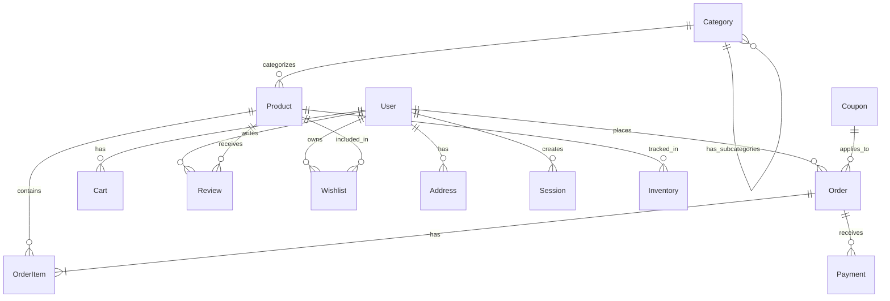
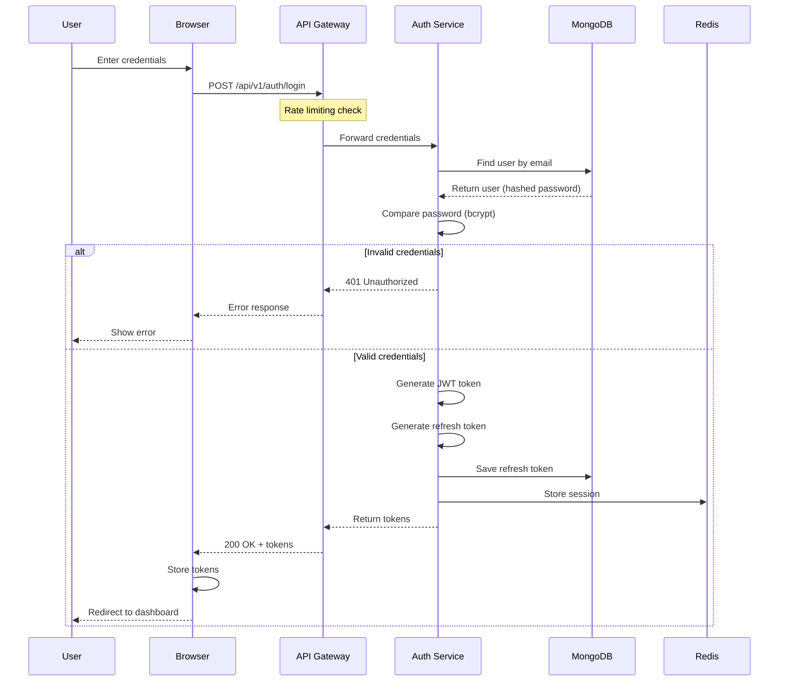
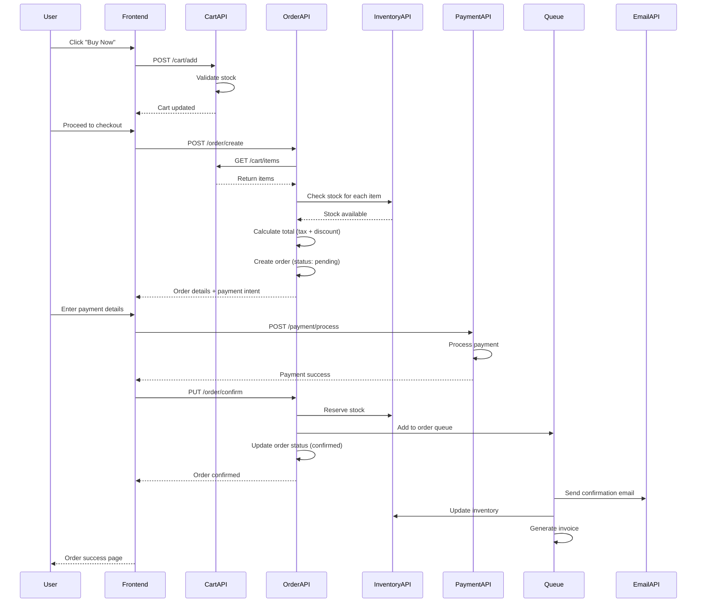

Here's the **complete project documentation** for your Flipkart Clone MERN application with all necessary diagrams, requirements, and flows.

## 📚 **Complete Project Documentation**

---

## 1. 📋 **System Requirements Specification (SRS)**

### **1.1 Project Overview**

```yaml
Project Name: Flipkart Clone - Enterprise E-commerce Platform
Technology Stack: MERN (MongoDB, Express.js, React.js, Node.js)
Architecture: Microservices + DevSecOps
Deployment: Docker + Kubernetes (AWS/GCP)
```

### **1.2 Functional Requirements**

| ID    | Requirement                | Priority | Module       |
| ----- | -------------------------- | -------- | ------------ |
| FR-01 | User Registration & Login  | High     | Auth         |
| FR-02 | Product Browsing & Search  | High     | Product      |
| FR-03 | Shopping Cart Management   | High     | Cart         |
| FR-04 | Order Placement            | High     | Order        |
| FR-05 | Payment Integration        | High     | Payment      |
| FR-06 | User Profile Management    | Medium   | User         |
| FR-07 | Product Reviews & Ratings  | Medium   | Review       |
| FR-08 | Wishlist                   | Medium   | Wishlist     |
| FR-09 | Order Tracking             | Medium   | Order        |
| FR-10 | Admin Dashboard            | High     | Admin        |
| FR-11 | Inventory Management       | High     | Admin        |
| FR-12 | Coupon & Discounts         | Low      | Coupon       |
| FR-13 | AI Product Recommendations | Medium   | AI           |
| FR-14 | Email Notifications        | Medium   | Notification |
| FR-15 | Mobile Responsive          | High     | Frontend     |

### **1.3 Non-Functional Requirements**

```yaml
Performance:
  - Response Time: < 200ms (API)
  - Concurrent Users: 10,000+
  - Page Load Time: < 2 seconds
  - Database Query Time: < 100ms

Security:
  - Authentication: JWT with refresh tokens
  - Encryption: AES-256 for sensitive data
  - Rate Limiting: 100 requests/minute per IP
  - Security Headers: CSP, HSTS, X-Frame-Options
  - Compliance: GDPR, PCI-DSS (for payments)

Availability:
  - Uptime: 99.9% (SLA)
  - RTO (Recovery Time Objective): 15 minutes
  - RPO (Recovery Point Objective): 5 minutes

Scalability:
  - Horizontal scaling with Kubernetes
  - Auto-scaling based on CPU/Memory
  - Database sharding ready
  - CDN for static assets

Maintainability:
  - Code Coverage: > 80%
  - Documentation: Complete
  - Logging: Centralized (ELK)
  - Monitoring: Prometheus + Grafana
```

### **1.4 Hardware Requirements**

| Component   | Development | Production (Minimum) | Production (Recommended) |
| ----------- | ----------- | -------------------- | ------------------------ |
| **CPU**     | 2 cores     | 4 cores              | 8+ cores                 |
| **RAM**     | 4 GB        | 8 GB                 | 16 GB                    |
| **Storage** | 20 GB SSD   | 100 GB SSD           | 500 GB SSD               |
| **Network** | 10 Mbps     | 100 Mbps             | 1 Gbps                   |

### **1.5 Software Requirements**

```yaml
Development Environment:
  - OS: Ubuntu 20.04+ / macOS 12+ / Windows 11
  - Node.js: v18.x or higher
  - MongoDB: v6.x
  - Redis: v7.x
  - Docker: v24.x
  - Kubernetes: v1.27+ (for production)
  - Git: v2.40+

Production Environment:
  - Container Orchestration: Kubernetes (EKS/GKE/AKS)
  - Database: MongoDB Atlas / AWS DocumentDB
  - Cache: Redis Enterprise / AWS ElastiCache
  - CDN: CloudFront / Cloudflare
  - Monitoring: Prometheus + Grafana
  - Logging: ELK Stack (Elasticsearch, Logstash, Kibana)
  - CI/CD: GitHub Actions / Jenkins
```

---

## 2. 🗺️ **ER Diagram (Entity Relationship)**

### **2.1 Complete Database Schema**

```sql
-- Users Table
User {
  _id ObjectId PK
  name String
  email String UK
  password String
  role Enum [user, admin, vendor]
  phone String
  avatar String
  isActive Boolean
  lastLogin Date
  refreshToken String
  createdAt Date
  updatedAt Date
}

-- Products Table
Product {
  _id ObjectId PK
  name String
  slug String UK
  description String
  price Number
  category Enum [Electronics, Fashion, Books, Home, Toys]
  brand String
  stock Number
  images [String]
  rating Number (0-5)
  numReviews Number
  isActive Boolean
  createdAt Date
  updatedAt Date
}

-- Categories Table
Category {
  _id ObjectId PK
  name String UK
  slug String UK
  parentId ObjectId FK -> Category
  image String
  description String
  isActive Boolean
}

-- Orders Table
Order {
  _id ObjectId PK
  orderId String UK
  user ObjectId FK -> User
  items [{
    product ObjectId FK -> Product
    name String
    price Number
    quantity Number
    total Number
  }]
  subtotal Number
  tax Number
  shipping Number
  discount Number
  totalAmount Number
  status Enum [pending, confirmed, processing, shipped, delivered, cancelled]
  paymentStatus Enum [pending, paid, failed, refunded]
  paymentMethod Enum [COD, Card, UPI, NetBanking]
  shippingAddress {
    street String
    city String
    state String
    pincode String
    country String
  }
  trackingId String
  deliveredAt Date
  cancelledAt Date
  createdAt Date
  updatedAt Date
}

-- Cart Table
Cart {
  _id ObjectId PK
  user ObjectId FK -> User UK
  items [{
    product ObjectId FK -> Product
    quantity Number
    price Number
    total Number
  }]
  totalAmount Number
  expiresAt Date
}

-- Reviews Table
Review {
  _id ObjectId PK
  user ObjectId FK -> User
  product ObjectId FK -> Product
  rating Number (1-5)
  title String
  comment String
  images [String]
  isVerified Boolean
  helpful [ObjectId FK -> User]
  createdAt Date
  updatedAt Date
}

-- Wishlist Table
Wishlist {
  _id ObjectId PK
  user ObjectId FK -> User UK
  products [ObjectId FK -> Product]
  createdAt Date
}

-- Coupons Table
Coupon {
  _id ObjectId PK
  code String UK
  description String
  discountType Enum [percentage, fixed]
  discountValue Number
  minOrderAmount Number
  maxDiscount Number
  usageLimit Number
  usedCount Number
  validFrom Date
  validUntil Date
  isActive Boolean
}

-- Payments Table
Payment {
  _id ObjectId PK
  order ObjectId FK -> Order
  user ObjectId FK -> User
  amount Number
  paymentMethod String
  transactionId String UK
  razorpayOrderId String
  razorpayPaymentId String
  status Enum [pending, success, failed, refunded]
  failureReason String
  metadata Object
  createdAt Date
}

-- Addresses Table
Address {
  _id ObjectId PK
  user ObjectId FK -> User
  name String
  phone String
  street String
  city String
  state String
  pincode String
  country String
  isDefault Boolean
  addressType Enum [home, work, other]
}

-- Inventory Table
Inventory {
  _id ObjectId PK
  product ObjectId FK -> Product
  warehouse String
  quantity Number
  reservedQuantity Number
  lastRestocked Date
  location {
    lat Number
    lng Number
  }
}

-- Sessions Table
Session {
  _id ObjectId PK
  user ObjectId FK -> User
  token String UK
  deviceInfo String
  ipAddress String
  expiresAt Date
  isActive Boolean
}
```

### **2.2 ER Diagram (Mermaid Format)**



### **2.3 Database Indexes**

```javascript
// Performance indexes
db.users.createIndex({ email: 1 }, { unique: true });
db.users.createIndex({ createdAt: -1 });

db.products.createIndex({ name: "text", description: "text" });
db.products.createIndex({ category: 1, price: -1 });
db.products.createIndex({ slug: 1 }, { unique: true });
db.products.createIndex({ createdAt: -1 });

db.orders.createIndex({ user: 1, createdAt: -1 });
db.orders.createIndex({ status: 1, paymentStatus: 1 });
db.orders.createIndex({ orderId: 1 }, { unique: true });

db.reviews.createIndex({ product: 1, createdAt: -1 });
db.reviews.createIndex({ user: 1, product: 1 }, { unique: true });

db.cart.createIndex({ user: 1 }, { unique: true });
db.cart.createIndex({ expiresAt: 1 }, { expireAfterSeconds: 0 });

db.sessions.createIndex({ expiresAt: 1 }, { expireAfterSeconds: 0 });
```

---

## 3. 🔄 **Data Flow Diagrams (DFD)**

### **3.1 Level 0 DFD (Context Diagram)**

```
┌─────────────────────────────────────────────────────────────┐
│                      FLIPKART CLONE SYSTEM                   │
│                                                              │
│  ┌──────────┐           ┌──────────┐                        │
│  │  Admin   │◄─────────►│          │                        │
│  └──────────┘           │          │                        │
│                         │  E-      │                        │
│  ┌──────────┐           │ COMMERCE │                        │
│  │  User    │◄─────────►│ PLATFORM │                        │
│  └──────────┘           │          │                        │
│                         │          │                        │
│  ┌──────────┐           │          │                        │
│  │ Payment  │◄─────────►│          │                        │
│  │ Gateway  │           └──────────┘                        │
│  └──────────┘                                                │
│                                                              │
│  External Entities:                                          │
│  - Admin (manages products, orders)                          │
│  - User (browses, purchases, reviews)                        │
│  - Payment Gateway (processes payments)                      │
└─────────────────────────────────────────────────────────────┘
```

### **3.2 Level 1 DFD (Major Processes)**

```
                         ┌─────────────────┐
                         │   User Request  │
                         └────────┬────────┘
                                  │
                    ┌─────────────┼─────────────┐
                    │             │             │
                    ▼             ▼             ▼
            ┌───────────┐  ┌───────────┐  ┌───────────┐
            │ Process 1 │  │ Process 2 │  │ Process 3 │
            │  Auth     │  │  Product  │  │  Order    │
            │  & User   │  │  Catalog  │  │  Mgmt     │
            └─────┬─────┘  └─────┬─────┘  └─────┬─────┘
                  │              │              │
                  ▼              ▼              ▼
            ┌───────────┐  ┌───────────┐  ┌───────────┐
            │  D1:      │  │  D2:      │  │  D3:      │
            │  Users    │  │  Products │  │  Orders   │
            │  DB       │  │  DB       │  │  DB       │
            └───────────┘  └───────────┘  └───────────┘
                  │              │              │
                  └──────────────┼──────────────┘
                                 │
                    ┌────────────┴────────────┐
                    │                         │
                    ▼                         ▼
            ┌───────────┐                 ┌───────────┐
            │ Process 4 │                 │ Process 5 │
            │  Cart &   │                 │  Payment  │
            │  Checkout │                 │  Gateway  │
            └─────┬─────┘                 └─────┬─────┘
                  │                             │
                  ▼                             ▼
            ┌───────────┐                 ┌───────────┐
            │  D4:      │                 │  External │
            │  Cart     │                 │  Payment  │
            │  DB       │                 │  Service  │
            └───────────┘                 └───────────┘
```

### **3.3 User Registration Data Flow**

```
┌────────┐    1. POST /register    ┌──────────┐    2. Validate Input    ┌──────────┐
│  User  │ ───────────────────────►│Controller│───────────────────────►│Validator │
└────────┘                          └──────────┘                        └─────┬────┘
                                                                              │
    6. Return Token                                                         3. Valid
      & User                                                                   │
     ┌────────┐                          ┌──────────┐                         ▼
     │  User  │◄─────────────────────────│  Auth    │◄───────────────────┌──────────┐
     └────────┘    5. Generate JWT       │ Service  │    4. Save User    │  MongoDB │
                    & Save User          └──────────┘ ──────────────────►│  Users   │
                                                                         └──────────┘

Flow Steps:
1. User submits registration form (name, email, password)
2. Controller receives request, calls validator
3. Validator checks email format, password strength
4. Auth service hashes password, saves to MongoDB
5. JWT token generated and returned
6. User receives token and user data
```

### **3.4 Order Placement Data Flow**

```
┌────────┐    1. POST /order       ┌──────────┐    2. Get Cart Items    ┌──────────┐
│  User  │ ───────────────────────►│ Order    │───────────────────────►│  Cart    │
└────────┘                          │Controller│                        │ Service  │
                                    └─────┬────┘                        └─────┬────┘
         6. Order Created                 │                                   │
          & Response                       │ 3. Check Stock                    │
     ┌────────┐                            ▼                                   ▼
     │  User  │◄───────────────────┌──────────┐                        ┌──────────┐
     └────────┘    5. Return       │  Order   │                        │ Product  │
                    Order Details   │ Service  │                        │ Service  │
                                    └─────┬────┘                        └─────┬────┘
                                          │                                   │
                                          │ 4. Create Order                    │
                                          │    & Reserve Stock                 │
                                          ▼                                   │
                                    ┌──────────┐                              │
                                    │  Order   │◄─────────────────────────────┘
                                    │   DB     │
                                    └──────────┘

Additional Async Flows:
- Email notification → Email Queue → Worker → SendGrid
- Inventory update → Inventory Queue → Worker → Warehouse API
- Payment processing → Payment Gateway → Razorpay/Stripe
```

---

## 4. 🏗️ **System Architecture Diagram**

### **4.1 High-Level Architecture**

```
┌─────────────────────────────────────────────────────────────────────────────┐
│                              CLIENT LAYER                                    │
│  ┌──────────┐  ┌──────────┐  ┌──────────┐  ┌──────────┐                    │
│  │ Web App  │  │ Mobile   │  │ Admin    │  │ API      │                    │
│  │ (React)  │  │ (React   │  │ Dashboard│  │ Gateway  │                    │
│  │          │  │ Native)  │  │          │  │          │                    │
│  └────┬─────┘  └────┬─────┘  └────┬─────┘  └────┬─────┘                    │
│       │             │             │             │                          │
│       └─────────────┴─────────────┴─────────────┘                          │
│                              │                                              │
│                              ▼ (HTTPS/WSS)                                  │
│  ┌───────────────────────────────────────────────────────────────────────┐ │
│  │                         CDN (CloudFront)                               │ │
│  │                   Static Assets (JS, CSS, Images)                      │ │
│  └───────────────────────────────────────────────────────────────────────┘ │
│                              │                                              │
│  ┌───────────────────────────────────────────────────────────────────────┐ │
│  │                    LOAD BALANCER (NGINX/ALB)                          │ │
│  │                    SSL Termination, Rate Limiting                      │ │
│  └───────────────────────────────────────────────────────────────────────┘ │
└─────────────────────────────────────────────────────────────────────────────┘
                                      │
┌─────────────────────────────────────────────────────────────────────────────┐
│                          APPLICATION LAYER (K8s)                            │
│                                                                              │
│  ┌─────────────────────────────────────────────────────────────────────┐   │
│  │                        API GATEWAY                                   │   │
│  │                   (Authentication, Routing)                          │   │
│  └───────────────┬─────────────────┬─────────────────┬─────────────────┘   │
│                  │                 │                 │                      │
│                  ▼                 ▼                 ▼                      │
│  ┌──────────────┐  ┌──────────────┐  ┌──────────────┐  ┌──────────────┐    │
│  │ Auth Service │  │ Product      │  │ Order        │  │ Payment      │    │
│  │ (Node.js)    │  │ Service      │  │ Service      │  │ Service      │    │
│  │ 3 replicas   │  │ (Node.js)    │  │ (Node.js)    │  │ (Node.js)    │    │
│  └──────────────┘  │ 5 replicas   │  │ 3 replicas   │  │ 2 replicas   │    │
│                    └──────────────┘  └──────────────┘  └──────────────┘    │
│  ┌──────────────┐  ┌──────────────┐  ┌──────────────┐  ┌──────────────┐    │
│  │ Cart Service │  │ Search       │  │ AI Service   │  │ Notification │    │
│  │ (Node.js)    │  │ Service      │  │ (OpenAI)     │  │ Service      │    │
│  │ 2 replicas   │  │ (Elastic)    │  │ 1 replica    │  │ 2 replicas   │    │
│  └──────────────┘  └──────────────┘  └──────────────┘  └──────────────┘    │
│                                                                              │
│  ┌─────────────────────────────────────────────────────────────────────┐   │
│  │                      MESSAGE QUEUE (Bull/Redis)                      │   │
│  │                   Email Queue | Order Queue | Report Queue           │   │
│  └─────────────────────────────────────────────────────────────────────┘   │
└─────────────────────────────────────────────────────────────────────────────┘
                                      │
┌─────────────────────────────────────────────────────────────────────────────┐
│                              DATA LAYER                                      │
│                                                                              │
│  ┌──────────────┐  ┌──────────────┐  ┌──────────────┐  ┌──────────────┐    │
│  │   MongoDB    │  │    Redis     │  │ Elasticsearch│  │     S3       │    │
│  │   Primary    │  │   Cache      │  │   Search     │  │   Images     │    │
│  │   Cluster    │  │   Cluster    │  │   Cluster    │  │   Storage    │    │
│  └──────────────┘  └──────────────┘  └──────────────┘  └──────────────┘    │
│                                                                              │
│  ┌──────────────┐  ┌──────────────┐  ┌──────────────┐                       │
│  │   MongoDB    │  │     Redis    │  │    Kafka     │                       │
│  │   Replica    │  │   Persist    │  │   Events     │                       │
│  │   (Backup)   │  │   (Backup)   │  │   Stream     │                       │
│  └──────────────┘  └──────────────┘  └──────────────┘                       │
└─────────────────────────────────────────────────────────────────────────────┘
                                      │
┌─────────────────────────────────────────────────────────────────────────────┐
│                         OBSERVABILITY LAYER                                  │
│                                                                              │
│  ┌──────────────┐  ┌──────────────┐  ┌──────────────┐  ┌──────────────┐    │
│  │  Prometheus  │  │   Grafana    │  │     ELK      │  │   Jaeger     │    │
│  │   Metrics    │  │  Dashboards  │  │    Logs      │  │   Tracing    │    │
│  └──────────────┘  └──────────────┘  └──────────────┘  └──────────────┘    │
└─────────────────────────────────────────────────────────────────────────────┘
```

---

## 5. 🔄 **Sequence Diagrams**

### **5.1 User Login Sequence**



### **5.2 Product Purchase Flow**



---

## 6. 📊 **Deployment Architecture**

### **6.1 Kubernetes Deployment Strategy**

```yaml
Environment: Production
Region: ap-south-1 (Mumbai)
Cluster: EKS (Elastic Kubernetes Service)

Node Groups:
  - Name: general-purpose
    Instance Type: t3.large
    Min: 3, Max: 10
    Use: API services

  - Name: memory-optimized
    Instance Type: r5.large
    Min: 2, Max: 5
    Use: MongoDB, Redis

  - Name: compute-optimized
    Instance Type: c5.large
    Min: 2, Max: 8
    Use: Search, Queue workers

Namespaces:
  - production (main apps)
  - staging (pre-production)
  - monitoring (Prometheus, Grafana)
  - logging (ELK stack)
  - security (Falco, OPA)

Service Types:
  - Public: LoadBalancer (API, Frontend)
  - Internal: ClusterIP (Services, DB)
  - External: ExternalName (Third-party APIs)

Ingress:
  - Controller: AWS Load Balancer Controller
  - SSL: AWS Certificate Manager
  - WAF: AWS WAF with OWASP rules
```

### **6.2 CI/CD Pipeline Flow**

```
┌─────────────────────────────────────────────────────────────────────────┐
│                         CI/CD PIPELINE (GitHub Actions)                  │
└─────────────────────────────────────────────────────────────────────────┘

Developer Push → GitHub → Trigger Pipeline
                              │
                              ▼
                    ┌─────────────────┐
                    │ 1. Code Checkout │
                    └────────┬────────┘
                             │
                             ▼
                    ┌─────────────────┐
                    │ 2. Install Deps  │
                    └────────┬────────┘
                             │
                             ▼
                    ┌─────────────────┐
                    │ 3. Lint & Format │
                    └────────┬────────┘
                             │
                             ▼
                    ┌─────────────────┐
                    │ 4. Unit Tests    │
                    └────────┬────────┘
                             │
                             ▼
                    ┌─────────────────┐
                    │ 5. Integration   │
                    │    Tests         │
                    └────────┬────────┘
                             │
              ┌──────────────┼──────────────┐
              │              │              │
              ▼              ▼              ▼
        ┌──────────┐  ┌──────────┐  ┌──────────┐
        │ SAST     │  │ SCA      │  │ Secrets  │
        │ Scan     │  │ Scan     │  │ Scan     │
        └────┬─────┘  └────┬─────┘  └────┬─────┘
             │             │             │
             └──────────────┼──────────────┘
                            │
                            ▼
                    ┌─────────────────┐
                    │ 6. Docker Build  │
                    └────────┬────────┘
                             │
                             ▼
                    ┌─────────────────┐
                    │ 7. Container    │
                    │    Scan         │
                    └────────┬────────┘
                             │
                             ▼
                    ┌─────────────────┐
                    │ 8. Push to ECR   │
                    └────────┬────────┘
                             │
                             ▼
                    ┌─────────────────┐
                    │ 9. Deploy to    │
                    │    Staging      │
                    └────────┬────────┘
                             │
                             ▼
                    ┌─────────────────┐
                    │ 10. DAST Scan   │
                    └────────┬────────┘
                             │
                      ┌──────┴──────┐
                      │  Tests OK?  │
                      └──────┬──────┘
                             │ Yes
                             ▼
                    ┌─────────────────┐
                    │ 11. Deploy to   │
                    │    Production   │
                    └────────┬────────┘
                             │
                             ▼
                    ┌─────────────────┐
                    │ 12. Smoke Tests │
                    └────────┬────────┘
                             │
                             ▼
                    ┌─────────────────┐
                    │ 13. Notify Slack│
                    └─────────────────┘
```

---

## 7. 📈 **API Documentation**

### **7.1 API Endpoints Summary**

| Method | Endpoint                     | Description        | Auth  |
| ------ | ---------------------------- | ------------------ | ----- |
| POST   | `/api/v1/auth/register`      | User registration  | No    |
| POST   | `/api/v1/auth/login`         | User login         | No    |
| POST   | `/api/v1/auth/logout`        | User logout        | Yes   |
| POST   | `/api/v1/auth/refresh`       | Refresh token      | Yes   |
| GET    | `/api/v1/products`           | Get all products   | No    |
| GET    | `/api/v1/products/:id`       | Get product by ID  | No    |
| POST   | `/api/v1/products`           | Create product     | Admin |
| PUT    | `/api/v1/products/:id`       | Update product     | Admin |
| DELETE | `/api/v1/products/:id`       | Delete product     | Admin |
| GET    | `/api/v1/products/search`    | Search products    | No    |
| GET    | `/api/v1/cart`               | Get user cart      | Yes   |
| POST   | `/api/v1/cart/add`           | Add to cart        | Yes   |
| PUT    | `/api/v1/cart/update`        | Update cart item   | Yes   |
| DELETE | `/api/v1/cart/remove/:id`    | Remove from cart   | Yes   |
| POST   | `/api/v1/orders`             | Create order       | Yes   |
| GET    | `/api/v1/orders/myorders`    | Get user orders    | Yes   |
| GET    | `/api/v1/orders/:id`         | Get order details  | Yes   |
| PUT    | `/api/v1/orders/:id/cancel`  | Cancel order       | Yes   |
| POST   | `/api/v1/payments/initiate`  | Initiate payment   | Yes   |
| POST   | `/api/v1/payments/verify`    | Verify payment     | Yes   |
| POST   | `/api/v1/ai/recommendations` | AI recommendations | Yes   |
| POST   | `/api/v1/ai/chat`            | AI chat assistant  | No    |

### **7.2 Sample API Request/Response**

```javascript
// POST /api/v1/orders
// Request
{
  "shippingAddress": {
    "street": "123 MG Road",
    "city": "Bangalore",
    "state": "Karnataka",
    "pincode": "560001",
    "country": "India"
  },
  "paymentMethod": "Card",
  "couponCode": "SAVE100"
}

// Response (201 Created)
{
  "success": true,
  "data": {
    "orderId": "ORD1702234567890ABC",
    "items": [
      {
        "product": {
          "_id": "656a3b8c1234567890abcdef",
          "name": "iPhone 14",
          "price": 69999
        },
        "quantity": 1,
        "total": 69999
      }
    ],
    "subtotal": 69999,
    "tax": 12599.82,
    "shipping": 0,
    "discount": 100,
    "totalAmount": 82498.82,
    "status": "pending",
    "paymentStatus": "pending",
    "paymentIntent": {
      "clientSecret": "pi_3Nqwertyuiop123456_secret_xyz"
    },
    "estimatedDelivery": "2024-01-15"
  },
  "message": "Order created successfully"
}
```

---

## 8. 🗄️ **Database Schema (MongoDB Collections)**

### **8.1 Collection: users**

```javascript
{
  "_id": ObjectId("656a3b8c1234567890abcdef"),
  "name": "Rahul Sharma",
  "email": "rahul@example.com",
  "password": "$2b$10$...hashed...",
  "role": "user",
  "phone": "+919876543210",
  "avatar": "https://cdn.flipkart.com/avatars/rahul.jpg",
  "isActive": true,
  "lastLogin": ISODate("2024-01-01T10:30:00Z"),
  "refreshToken": "eyJhbGciOiJIUzI1NiIs...",
  "createdAt": ISODate("2023-12-01T00:00:00Z"),
  "updatedAt": ISODate("2024-01-01T10:30:00Z")
}
```

### **8.2 Collection: products**

```javascript
{
  "_id": ObjectId("656a3b8c1234567890abcdef"),
  "name": "Apple iPhone 14",
  "slug": "apple-iphone-14",
  "description": "Latest iPhone with A15 Bionic chip...",
  "price": 69999,
  "category": "Electronics",
  "brand": "Apple",
  "stock": 50,
  "images": [
    "https://cdn.flipkart.com/iphone14/1.jpg",
    "https://cdn.flipkart.com/iphone14/2.jpg"
  ],
  "rating": 4.5,
  "numReviews": 128,
  "specifications": {
    "ram": "6GB",
    "storage": "128GB",
    "color": "Blue"
  },
  "isActive": true,
  "createdAt": ISODate("2023-12-01T00:00:00Z"),
  "updatedAt": ISODate("2024-01-01T10:30:00Z")
}
```

---

## 9. 🔒 **Security Requirements**

### **9.1 Authentication & Authorization**

```yaml
Authentication:
  - JWT tokens (access + refresh)
  - Token expiry: 15 minutes (access), 7 days (refresh)
  - Password hashing: bcrypt (10 rounds)
  - Rate limiting: 100 requests/minute per IP

Authorization:
  - Role-based access (RBAC)
  - Roles: user, admin, vendor
  - Resource-based permissions
  - API key for external services
```

### **9.2 Security Headers**

```javascript
// Helmet.js configuration
{
  "Content-Security-Policy": "default-src 'self'",
  "X-Frame-Options": "DENY",
  "X-Content-Type-Options": "nosniff",
  "X-XSS-Protection": "1; mode=block",
  "Strict-Transport-Security": "max-age=31536000; includeSubDomains"
}
```

---

## 10. 📋 **Testing Strategy**

### **10.1 Test Coverage Requirements**

| Test Type         | Coverage Required | Tools     |
| ----------------- | ----------------- | --------- |
| Unit Tests        | 80%               | Jest      |
| Integration Tests | 70%               | Supertest |
| E2E Tests         | Critical paths    | Cypress   |
| Security Tests    | 100% of auth      | OWASP ZAP |
| Performance Tests | <200ms response   | K6        |

### **10.2 Test Environment**

```yaml
Unit Tests:
  - Database: MongoDB Memory Server
  - Cache: Mock Redis
  - External APIs: Mocked

Integration Tests:
  - Database: Test MongoDB instance
  - Cache: Test Redis instance
  - External APIs: Sandbox environments

E2E Tests:
  - Full stack with test database
  - Headless browser (Puppeteer)
  - Test user accounts
```

---

## 11. 🚀 **Deployment Checklist**

```markdown
## Pre-Deployment Checklist

### Infrastructure

- [ ] Kubernetes cluster provisioned
- [ ] MongoDB Atlas cluster configured
- [ ] Redis cluster setup
- [ ] S3 buckets created for static assets
- [ ] CDN configured (CloudFront)
- [ ] Load balancer configured
- [ ] SSL certificates installed
- [ ] WAF rules configured

### Security

- [ ] Environment variables encrypted
- [ ] Secrets stored in Vault/K8s secrets
- [ ] Network policies applied
- [ ] Security groups configured
- [ ] Rate limiting enabled
- [ ] DDoS protection enabled
- [ ] Audit logging enabled

### Application

- [ ] All tests passing
- [ ] Security scans passed
- [ ] Docker image built and scanned
- [ ] Database migrations ready
- [ ] Backup strategy in place
- [ ] Monitoring configured
- [ ] Alerting rules set

### Documentation

- [ ] API documentation updated
- [ ] Runbooks prepared
- [ ] Rollback plan documented
- [ ] On-call schedule defined
```

---

## 12. 📊 **Monitoring & Alerting**

### **12.1 Key Metrics**

```yaml
Application Metrics:
  - Request rate (req/sec)
  - Error rate (5xx responses)
  - Response time (p50, p95, p99)
  - Active users
  - Order conversion rate

Infrastructure Metrics:
  - CPU utilization
  - Memory usage
  - Network I/O
  - Disk usage
  - Pod status

Database Metrics:
  - Query execution time
  - Connection pool size
  - Replication lag
  - Cache hit ratio

Business Metrics:
  - Daily active users
  - Orders per hour
  - Revenue
  - Average order value
```

### **12.2 Alert Rules**

```yaml
Critical Alerts (PagerDuty):
  - API error rate > 5% for 5 minutes
  - Database down
  - Payment gateway failures
  - Disk space < 10%
  - Memory usage > 90%

Warning Alerts (Slack):
  - Response time > 500ms
  - CPU > 80% for 10 minutes
  - Failed logins > 100/minute
  - Queue length > 1000
```

---

## 13. 📝 **Maintenance & Support**

### **13.1 Backup Strategy**

```yaml
MongoDB:
  - Full backup: Daily at 2 AM
  - Incremental: Every 6 hours
  - Retention: 30 days
  - Off-site: S3 (encrypted)

Redis:
  - RDB snapshot: Every hour
  - AOF persistence: Every second
  - Retention: 7 days

Application Logs:
  - ELK stack retention: 30 days
  - Error logs: 90 days
  - Audit logs: 1 year
```

### **13.2 Disaster Recovery**

```yaml
RTO: 15 minutes
RPO: 5 minutes

Failover Steps: 1. Detect primary region failure
  2. Route traffic to secondary region (Route53)
  3. Promote replica database to primary
  4. Verify system health
  5. Notify team

Testing:
  - DR drill: Every quarter
  - Backup restore: Monthly
```

---

## 14. 📄 **Documentation Deliverables Checklist**

- [x] System Requirements Specification (SRS)
- [x] ER Diagram & Database Schema
- [x] Data Flow Diagrams (Level 0, 1, 2)
- [x] System Architecture Diagram
- [x] Sequence Diagrams (User flows)
- [x] Deployment Architecture
- [x] CI/CD Pipeline Flow
- [x] API Documentation
- [x] Security Requirements
- [x] Testing Strategy
- [x] Monitoring & Alerting
- [x] Maintenance Plan

---

This documentation serves as the **complete blueprint** for your Flipkart Clone project. All stakeholders (developers, testers, DevOps, management) can use this as the single source of truth! 🎉
