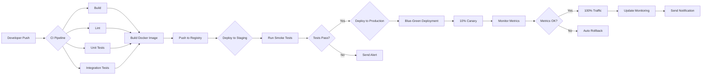

Excellent question! Let me explain the **complete CI/CD process** for your Flipkart clone - from code commit to production deployment with containers.

## 🚀 **CI/CD Complete Pipeline Overview**

**CI (Continuous Integration)**: Automatically build and test code when developers push changes
**CD (Continuous Delivery/Deployment)**: Automatically deploy tested code to production

```
Developer Push → GitHub → CI Pipeline → Build → Test → Docker → Deploy → Production
     ↓              ↓          ↓         ↓       ↓        ↓         ↓          ↓
   git push    Webhook     Jenkins/   npm test  Docker   Push to   K8s/AWS   Live
                           GitHub    coverage  build    Registry  Deploy    Server
                           Actions
```

---

## 📦 **Part 1: Complete CI/CD Pipeline Architecture**

### **The Full Flow with Containers**

```
┌─────────────────────────────────────────────────────────────────────────────┐
│                           CI/CD PIPELINE (GitHub Actions)                    │
├─────────────────────────────────────────────────────────────────────────────┤
│                                                                              │
│  ┌──────────┐    ┌──────────┐    ┌──────────┐    ┌──────────┐              │
│  │ 1. Code  │───▶│ 2. Build │───▶│ 3. Test  │───▶│ 4. Sonar │              │
│  │  Checkout│    │   & Lint │    │  & Cover │    │   Qube   │              │
│  └──────────┘    └──────────┘    └──────────┘    └──────────┘              │
│       │               │               │               │                     │
│       ▼               ▼               ▼               ▼                     │
│  ┌──────────┐    ┌──────────┐    ┌──────────┐    ┌──────────┐              │
│  │ 5. Docker│───▶│ 6. Push  │───▶│ 7. Deploy│───▶│ 8. Health│              │
│  │   Build  │    │   Image  │    │   to K8s │    │   Check  │              │
│  └──────────┘    └──────────┘    └──────────┘    └──────────┘              │
│                                                                              │
└─────────────────────────────────────────────────────────────────────────────┘
         │                   │                    │
         ▼                   ▼                    ▼
    Docker Registry    Kubernetes Cluster    Production Server
    (Docker Hub/ECR)   (AWS EKS/GKE)         (Live App)
```

---

## 🔧 **Part 2: GitHub Actions CI/CD Workflow**

### **Complete `.github/workflows/ci-cd.yml`**

```yaml
name: Flipkart Clone CI/CD Pipeline

# Trigger on push to main/master branch
on:
  push:
    branches: [main, develop]
    paths-ignore:
      - "README.md"
      - "docs/**"
  pull_request:
    branches: [main]
  workflow_dispatch: # Manual trigger

# Environment variables
env:
  DOCKER_REGISTRY: docker.io
  DOCKER_IMAGE_NAME: flipkart-clone
  K8S_NAMESPACE: production

jobs:
  # ==================== JOB 1: Build & Test ====================
  build-and-test:
    name: 🔨 Build & Test Application
    runs-on: ubuntu-latest

    services:
      # Spin up MongoDB for integration tests
      mongodb:
        image: mongo:6
        ports:
          - 27017:27017

      # Spin up Redis for tests
      redis:
        image: redis:7-alpine
        ports:
          - 6379:6379

    steps:
      # Step 1: Checkout code
      - name: 📥 Checkout Code
        uses: actions/checkout@v3
        with:
          fetch-depth: 0

      # Step 2: Setup Node.js
      - name: 🔧 Setup Node.js
        uses: actions/setup-node@v3
        with:
          node-version: "18"
          cache: "npm"

      # Step 3: Install dependencies
      - name: 📦 Install Dependencies
        run: npm ci

      # Step 4: Lint code
      - name: 🔍 Run Linter
        run: npm run lint

      # Step 5: Run Unit Tests
      - name: 🧪 Run Unit Tests
        run: npm run test:unit
        env:
          NODE_ENV: test
          JWT_SECRET: test_secret

      # Step 6: Run Integration Tests
      - name: 🔗 Run Integration Tests
        run: npm run test:integration
        env:
          NODE_ENV: test
          MONGODB_URI: mongodb://localhost:27017/test
          REDIS_HOST: localhost

      # Step 7: Run E2E Tests
      - name: 🎭 Run E2E Tests
        run: npm run test:e2e

      # Step 8: Generate Coverage Report
      - name: 📊 Generate Coverage Report
        run: npm run test:coverage

      # Step 9: Upload coverage to Codecov
      - name: 📤 Upload Coverage
        uses: codecov/codecov-action@v3
        with:
          token: ${{ secrets.CODECOV_TOKEN }}
          files: ./coverage/lcov.info

      # Step 10: Build application
      - name: 🏗️ Build Application
        run: npm run build

      # Step 11: Upload build artifacts
      - name: 💾 Upload Artifacts
        uses: actions/upload-artifact@v3
        with:
          name: build-output
          path: |
            dist/
            package.json
            package-lock.json
          retention-days: 7

  # ==================== JOB 2: Security Scan ====================
  security-scan:
    name: 🔒 Security Scan
    runs-on: ubuntu-latest
    needs: build-and-test

    steps:
      - name: 📥 Checkout Code
        uses: actions/checkout@v3

      # Snyk security scan
      - name: 🛡️ Run Snyk Security Scan
        uses: snyk/actions/node@master
        env:
          SNYK_TOKEN: ${{ secrets.SNYK_TOKEN }}
        with:
          args: --severity-threshold=high

      # Docker image scan
      - name: 🐳 Scan Docker Image
        uses: aquasecurity/trivy-action@master
        with:
          image-ref: ${{ env.DOCKER_IMAGE_NAME }}:latest
          format: "sarif"
          output: "trivy-results.sarif"

      # OWASP Dependency Check
      - name: 🔍 OWASP Dependency Check
        uses: dependency-check/Dependency-Check_Action@main
        with:
          project: "Flipkart Clone"
          path: "."
          format: "HTML"
          out: "reports"

      # Upload security reports
      - name: 📤 Upload Security Reports
        uses: actions/upload-artifact@v3
        with:
          name: security-reports
          path: reports/

  # ==================== JOB 3: Build Docker Image ====================
  build-docker:
    name: 🐳 Build & Push Docker Image
    runs-on: ubuntu-latest
    needs: [build-and-test, security-scan]
    # Only run on main branch or tags
    if: github.ref == 'refs/heads/main' || startsWith(github.ref, 'refs/tags/')

    steps:
      - name: 📥 Checkout Code
        uses: actions/checkout@v3

      # Login to Docker Registry
      - name: 🔐 Login to Docker Hub
        uses: docker/login-action@v2
        with:
          username: ${{ secrets.DOCKER_USERNAME }}
          password: ${{ secrets.DOCKER_PASSWORD }}

      # Set up Docker Buildx
      - name: 📦 Set up Docker Buildx
        uses: docker/setup-buildx-action@v2

      # Get version number
      - name: 🏷️ Get Version
        id: get_version
        run: |
          echo "VERSION=${GITHUB_REF#refs/tags/}" >> $GITHUB_OUTPUT
          echo "COMMIT_SHA=${GITHUB_SHA::8}" >> $GITHUB_OUTPUT

      # Build and push multi-architecture image
      - name: 🏗️ Build and Push Docker Image
        uses: docker/build-push-action@v4
        with:
          context: .
          file: docker/Dockerfile
          push: true
          tags: |
            ${{ env.DOCKER_REGISTRY }}/${{ env.DOCKER_IMAGE_NAME }}:latest
            ${{ env.DOCKER_REGISTRY }}/${{ env.DOCKER_IMAGE_NAME }}:${{ steps.get_version.outputs.VERSION }}
            ${{ env.DOCKER_REGISTRY }}/${{ env.DOCKER_IMAGE_NAME }}:${{ steps.get_version.outputs.COMMIT_SHA }}
          platforms: linux/amd64,linux/arm64
          cache-from: type=gha
          cache-to: type=gha,mode=max
          build-args: |
            NODE_ENV=production
            VERSION=${{ steps.get_version.outputs.VERSION }}

  # ==================== JOB 4: Deploy to Staging ====================
  deploy-staging:
    name: 🚀 Deploy to Staging
    runs-on: ubuntu-latest
    needs: build-docker
    environment: staging

    steps:
      - name: 📥 Checkout Code
        uses: actions/checkout@v3

      # Configure kubectl
      - name: 🔧 Configure kubectl
        uses: azure/setup-kubectl@v3
        with:
          version: "latest"

      # Set Kubeconfig for staging
      - name: 🔑 Set Kubeconfig
        run: |
          mkdir -p $HOME/.kube
          echo "${{ secrets.STAGING_KUBE_CONFIG }}" | base64 --decode > $HOME/.kube/config

      # Deploy to staging Kubernetes
      - name: 🚢 Deploy to Staging
        run: |
          # Update image in deployment
          kubectl set image deployment/flipkart-app \
            app=${{ env.DOCKER_REGISTRY }}/${{ env.DOCKER_IMAGE_NAME }}:${{ github.sha }} \
            -n staging

          # Wait for rollout
          kubectl rollout status deployment/flipkart-app -n staging --timeout=5m

      # Run smoke tests
      - name: 🔥 Run Smoke Tests
        run: |
          # Wait for service to be ready
          sleep 30
          # Test health endpoint
          curl -f https://staging.yourdomain.com/health || exit 1

      # Send notification to Slack
      - name: 💬 Send Slack Notification
        uses: act10ns/slack@v1
        with:
          status: ${{ job.status }}
          channel: "#deployments"
        env:
          SLACK_WEBHOOK_URL: ${{ secrets.SLACK_WEBHOOK }}
        if: always()

  # ==================== JOB 5: Integration Tests on Staging ====================
  staging-tests:
    name: 🧪 Integration Tests on Staging
    runs-on: ubuntu-latest
    needs: deploy-staging
    environment: staging

    steps:
      - name: 📥 Checkout Code
        uses: actions/checkout@v3

      - name: 🔗 Run API Tests on Staging
        run: |
          npm run test:api -- --base-url=https://staging.yourdomain.com
        env:
          STAGING_API_KEY: ${{ secrets.STAGING_API_KEY }}

      - name: 🎭 Run E2E Tests on Staging
        run: |
          npm run test:e2e -- --base-url=https://staging.yourdomain.com

      - name: 📊 Performance Test
        run: |
          npm run test:performance -- --url=https://staging.yourdomain.com

  # ==================== JOB 6: Deploy to Production ====================
  deploy-production:
    name: 🚀 Deploy to Production
    runs-on: ubuntu-latest
    needs: [staging-tests, build-docker]
    environment: production
    # Manual approval required
    if: github.ref == 'refs/heads/main'

    steps:
      - name: 📥 Checkout Code
        uses: actions/checkout@v3

      # Configure kubectl for production
      - name: 🔧 Configure kubectl
        uses: azure/setup-kubectl@v3

      - name: 🔑 Set Kubeconfig for Production
        run: |
          echo "${{ secrets.PROD_KUBE_CONFIG }}" | base64 --decode > $HOME/.kube/config

      # Deploy with Blue-Green strategy
      - name: 🔵 Blue-Green Deployment
        run: |
          # Deploy new version as 'green'
          kubectl apply -f k8s/deployment-green.yaml

          # Wait for green deployment to be ready
          kubectl rollout status deployment/flipkart-app-green -n production

          # Run validation tests on green
          kubectl exec -it deployment/flipkart-app-green -n production -- node healthcheck.js

          # Switch traffic from blue to green
          kubectl patch service flipkart-service -n production -p '{"spec":{"selector":{"version":"green"}}}'

          # Keep blue for rollback
          echo "Blue deployment kept for rollback"

      # Canary deployment (10% traffic first)
      - name: 🐤 Canary Deployment
        run: |
          # Send 10% traffic to new version
          kubectl apply -f k8s/canary.yaml

          # Monitor for 5 minutes
          sleep 300

          # If metrics good, increase to 100%
          kubectl patch canary flipkart-canary -p '{"spec":{"weight":100}}'

      # Database migrations (if any)
      - name: 🗄️ Run Database Migrations
        run: |
          kubectl create job --from=cronjob/db-migrations db-migrate-$(date +%s) -n production

      # Update monitoring
      - name: 📈 Update Monitoring
        run: |
          # Update New Relic deployment marker
          curl -X PUT "https://api.newrelic.com/v2/applications/${{ secrets.NEWRELIC_APP_ID }}/deployments.json" \
            -H "X-Api-Key:${{ secrets.NEWRELIC_API_KEY }}" \
            -d "{\"deployment\":{\"revision\":\"${{ github.sha }}\",\"description\":\"Deployed via GitHub Actions\"}}"

      # Rollback on failure
      - name: 🔄 Rollback on Failure
        if: failure()
        run: |
          echo "Deployment failed! Rolling back..."
          kubectl rollout undo deployment/flipkart-app -n production
          kubectl rollout status deployment/flipkart-app -n production

  # ==================== JOB 7: Post-Deployment Verification ====================
  verify-deployment:
    name: ✅ Verify Production Deployment
    runs-on: ubuntu-latest
    needs: deploy-production

    steps:
      - name: 🔍 Health Check
        run: |
          for i in {1..30}; do
            if curl -f https://api.yourdomain.com/health; then
              echo "✅ Service is healthy"
              exit 0
            fi
            sleep 10
          done
          echo "❌ Service failed health check"
          exit 1

      - name: 📊 Verify Metrics
        run: |
          # Check error rate
          ERROR_RATE=$(curl -s https://prometheus.yourdomain.com/api/v1/query?query=rate(http_requests_total{status=~"5.."}[5m]))
          if [ "$ERROR_RATE" -gt 0.01 ]; then
            echo "⚠️ High error rate detected: $ERROR_RATE"
            exit 1
          fi

      - name: 💬 Send Success Notification
        uses: act10ns/slack@v1
        with:
          status: success
          channel: "#deployments"
          message: "✅ Production deployment successful! Version: ${{ github.sha }}"
        env:
          SLACK_WEBHOOK_URL: ${{ secrets.SLACK_WEBHOOK }}
```

---

## 🐳 **Part 3: Container Management with Docker**

### **Optimized Production Dockerfile**

**`docker/Dockerfile`**:

```dockerfile
# ============================================
# Stage 1: Dependencies
# ============================================
FROM node:18-alpine AS deps

WORKDIR /app

# Copy package files
COPY package*.json ./
COPY yarn.lock ./

# Install all dependencies (including dev)
RUN npm ci

# ============================================
# Stage 2: Builder
# ============================================
FROM node:18-alpine AS builder

WORKDIR /app

# Copy dependencies from deps stage
COPY --from=deps /app/node_modules ./node_modules
COPY . .

# Build the application
RUN npm run build

# Prune dev dependencies
RUN npm prune --production

# ============================================
# Stage 3: Production
# ============================================
FROM node:18-alpine AS production

WORKDIR /app

# Create non-root user for security
RUN addgroup -g 1001 -S nodejs && \
    adduser -S nodejs -u 1001

# Install dumb-init for proper signal handling
RUN apk add --no-cache dumb-init

# Copy built application
COPY --from=builder --chown=nodejs:nodejs /app/dist ./dist
COPY --from=builder --chown=nodejs:nodejs /app/node_modules ./node_modules
COPY --chown=nodejs:nodejs package*.json ./

# Create necessary directories
RUN mkdir -p logs uploads && \
    chown -R nodejs:nodejs logs uploads

# Switch to non-root user
USER nodejs

# Expose port
EXPOSE 3000

# Health check
HEALTHCHECK --interval=30s --timeout=3s --start-period=5s --retries=3 \
  CMD node -e "require('http').get('http://localhost:3000/health', (r) => {r.statusCode === 200 ? process.exit(0) : process.exit(1)})"

# Start with dumb-init
ENTRYPOINT ["dumb-init", "--"]

# Run the application
CMD ["node", "dist/server.js"]
```

### **Multi-Service Docker Compose for Production**

**`docker/docker-compose.prod.yml`**:

```yaml
version: "3.8"

services:
  # Nginx Load Balancer
  nginx:
    image: nginx:alpine
    container_name: flipkart-nginx
    ports:
      - "80:80"
      - "443:443"
    volumes:
      - ./nginx.prod.conf:/etc/nginx/nginx.conf:ro
      - ./ssl:/etc/nginx/ssl:ro
    depends_on:
      - app
    networks:
      - flipkart-net

  # Node.js App (3 replicas for load balancing)
  app:
    build:
      context: ..
      dockerfile: docker/Dockerfile
      target: production
    image: flipkart-clone:${VERSION:-latest}
    restart: always
    environment:
      NODE_ENV: production
      PORT: 3000
    env_file:
      - ../.env.production
    depends_on:
      - mongodb
      - redis
    networks:
      - flipkart-net
    deploy:
      replicas: 3
      resources:
        limits:
          cpus: "1"
          memory: 1G
        reservations:
          cpus: "0.5"
          memory: 512M
      restart_policy:
        condition: on-failure
        max_attempts: 3
      update_config:
        parallelism: 1
        delay: 10s
        order: start-first
      rollback_config:
        parallelism: 1
        delay: 10s

  # MongoDB with Replica Set
  mongodb:
    image: mongo:6
    container_name: flipkart-mongodb
    restart: always
    command: mongod --replSet rs0 --bind_ip_all
    volumes:
      - mongodb_prod_data:/data/db
      - mongodb_prod_config:/data/configdb
    environment:
      MONGO_INITDB_ROOT_USERNAME: ${MONGO_ROOT_USER}
      MONGO_INITDB_ROOT_PASSWORD: ${MONGO_ROOT_PASSWORD}
    networks:
      - flipkart-net
    deploy:
      resources:
        limits:
          cpus: "2"
          memory: 2G

  # Redis Cache
  redis:
    image: redis:7-alpine
    container_name: flipkart-redis
    restart: always
    command: redis-server --appendonly yes --requirepass ${REDIS_PASSWORD}
    volumes:
      - redis_prod_data:/data
    networks:
      - flipkart-net
    deploy:
      resources:
        limits:
          cpus: "0.5"
          memory: 512M

  # Elasticsearch
  elasticsearch:
    image: elasticsearch:8.10.0
    container_name: flipkart-elasticsearch
    restart: always
    environment:
      - discovery.type=single-node
      - xpack.security.enabled=false
      - "ES_JAVA_OPTS=-Xms1g -Xmx1g"
    volumes:
      - elasticsearch_prod_data:/usr/share/elasticsearch/data
    networks:
      - flipkart-net
    deploy:
      resources:
        limits:
          cpus: "1"
          memory: 2G

  # Prometheus for metrics
  prometheus:
    image: prom/prometheus:latest
    container_name: flipkart-prometheus
    restart: always
    volumes:
      - ./prometheus.yml:/etc/prometheus/prometheus.yml
      - prometheus_prod_data:/prometheus
    command:
      - "--config.file=/etc/prometheus/prometheus.yml"
      - "--storage.tsdb.path=/prometheus"
      - "--storage.tsdb.retention.time=30d"
    networks:
      - flipkart-net

  # Grafana for visualization
  grafana:
    image: grafana/grafana:latest
    container_name: flipkart-grafana
    restart: always
    environment:
      GF_SECURITY_ADMIN_PASSWORD: ${GRAFANA_PASSWORD}
      GF_INSTALL_PLUGINS: grafana-piechart-panel
    volumes:
      - grafana_prod_data:/var/lib/grafana
    networks:
      - flipkart-net

networks:
  flipkart-net:
    driver: overlay
    attachable: true

volumes:
  mongodb_prod_data:
  mongodb_prod_config:
  redis_prod_data:
  elasticsearch_prod_data:
  prometheus_prod_data:
  grafana_prod_data:
```

---

## ☸️ **Part 4: Kubernetes Deployment for Production**

### **Kubernetes Deployment Configuration**

**`k8s/deployment.yaml`**:

```yaml
apiVersion: apps/v1
kind: Deployment
metadata:
  name: flipkart-app
  namespace: production
  labels:
    app: flipkart
    tier: backend
    version: stable
spec:
  replicas: 5
  strategy:
    type: RollingUpdate
    rollingUpdate:
      maxSurge: 2
      maxUnavailable: 1
  selector:
    matchLabels:
      app: flipkart
  template:
    metadata:
      labels:
        app: flipkart
        version: stable
    spec:
      containers:
        - name: app
          image: docker.io/flipkart-clone:latest
          imagePullPolicy: Always
          ports:
            - containerPort: 3000
              name: http
          env:
            - name: NODE_ENV
              value: "production"
            - name: MONGO_URI
              valueFrom:
                secretKeyRef:
                  name: mongodb-secret
                  key: uri
          resources:
            requests:
              memory: "512Mi"
              cpu: "500m"
            limits:
              memory: "1Gi"
              cpu: "1000m"
          livenessProbe:
            httpGet:
              path: /health
              port: 3000
            initialDelaySeconds: 30
            periodSeconds: 10
          readinessProbe:
            httpGet:
              path: /ready
              port: 3000
            initialDelaySeconds: 5
            periodSeconds: 5
          volumeMounts:
            - name: logs
              mountPath: /app/logs
      volumes:
        - name: logs
          persistentVolumeClaim:
            claimName: logs-pvc
---
apiVersion: v1
kind: Service
metadata:
  name: flipkart-service
  namespace: production
spec:
  selector:
    app: flipkart
  ports:
    - port: 80
      targetPort: 3000
      protocol: TCP
  type: LoadBalancer
  sessionAffinity: ClientIP
---
apiVersion: autoscaling/v2
kind: HorizontalPodAutoscaler
metadata:
  name: flipkart-hpa
  namespace: production
spec:
  scaleTargetRef:
    apiVersion: apps/v1
    kind: Deployment
    name: flipkart-app
  minReplicas: 3
  maxReplicas: 20
  metrics:
    - type: Resource
      resource:
        name: cpu
        target:
          type: Utilization
          averageUtilization: 70
    - type: Resource
      resource:
        name: memory
        target:
          type: Utilization
          averageUtilization: 80
```

### **Ingress with SSL/TLS**

**`k8s/ingress.yaml`**:

```yaml
apiVersion: networking.k8s.io/v1
kind: Ingress
metadata:
  name: flipkart-ingress
  namespace: production
  annotations:
    kubernetes.io/ingress.class: nginx
    cert-manager.io/cluster-issuer: letsencrypt-prod
    nginx.ingress.kubernetes.io/rate-limit: "100"
    nginx.ingress.kubernetes.io/proxy-body-size: "10m"
spec:
  tls:
    - hosts:
        - api.flipkart-clone.com
      secretName: tls-secret
  rules:
    - host: api.flipkart-clone.com
      http:
        paths:
          - path: /
            pathType: Prefix
            backend:
              service:
                name: flipkart-service
                port:
                  number: 80
```

---

## 🚀 **Part 5: Deployment Scripts**

### **Automated Deployment Script**

**`scripts/deployment/deploy.sh`**:

```bash
#!/bin/bash

set -e

# Colors for output
RED='\033[0;31m'
GREEN='\033[0;32m'
YELLOW='\033[1;33m'
NC='\033[0m'

echo -e "${GREEN}🚀 Starting deployment process...${NC}"

# Variables
VERSION=$(git rev-parse --short HEAD)
TIMESTAMP=$(date +%Y%m%d_%H%M%S)
DEPLOY_ENV=${1:-production}

echo -e "${YELLOW}📦 Environment: $DEPLOY_ENV"
echo -e "${YELLOW}🔖 Version: $VERSION${NC}"

# Step 1: Run tests
echo -e "${GREEN}🧪 Running tests...${NC}"
npm run test:unit
npm run test:integration

# Step 2: Build application
echo -e "${GREEN}🏗️ Building application...${NC}"
npm run build

# Step 3: Build Docker image
echo -e "${GREEN}🐳 Building Docker image...${NC}"
docker build -f docker/Dockerfile -t flipkart-clone:$VERSION .
docker tag flipkart-clone:$VERSION flipkart-clone:latest

# Step 4: Push to registry
echo -e "${GREEN}📤 Pushing to Docker registry...${NC}"
docker tag flipkart-clone:$VERSION $DOCKER_REGISTRY/flipkart-clone:$VERSION
docker push $DOCKER_REGISTRY/flipkart-clone:$VERSION

# Step 5: Deploy to Kubernetes
echo -e "${GREEN}☸️ Deploying to Kubernetes...${NC}"
kubectl set image deployment/flipkart-app \
  app=$DOCKER_REGISTRY/flipkart-clone:$VERSION \
  -n $DEPLOY_ENV

# Step 6: Wait for rollout
echo -e "${GREEN}⏳ Waiting for rollout...${NC}"
kubectl rollout status deployment/flipkart-app -n $DEPLOY_ENV --timeout=5m

# Step 7: Health check
echo -e "${GREEN}🏥 Running health check...${NC}"
sleep 10
if curl -f https://api.flipkart-clone.com/health; then
    echo -e "${GREEN}✅ Deployment successful!${NC}"
else
    echo -e "${RED}❌ Health check failed! Rolling back...${NC}"
    kubectl rollout undo deployment/flipkart-app -n $DEPLOY_ENV
    exit 1
fi

# Step 8: Send notification
echo -e "${GREEN}💬 Sending notification...${NC}"
curl -X POST -H 'Content-type: application/json' \
  --data "{\"text\":\"✅ Deployment $VERSION to $DEPLOY_ENV successful!\"}" \
  $SLACK_WEBHOOK_URL

echo -e "${GREEN}🎉 Deployment complete!${NC}"
```

---

## 📊 **Part 6: Monitoring & Observability**

### **Prometheus Configuration**

**`docker/prometheus.yml`**:

```yaml
global:
  scrape_interval: 15s
  evaluation_interval: 15s

alerting:
  alertmanagers:
    - static_configs:
        - targets: ["alertmanager:9093"]

rule_files:
  - "alerts.yml"

scrape_configs:
  - job_name: "flipkart-app"
    metrics_path: "/metrics"
    static_configs:
      - targets: ["app:3000"]
        labels:
          environment: "production"
          service: "flipkart-api"

  - job_name: "mongodb"
    static_configs:
      - targets: ["mongodb-exporter:9216"]

  - job_name: "redis"
    static_configs:
      - targets: ["redis-exporter:9121"]

  - job_name: "nginx"
    static_configs:
      - targets: ["nginx-exporter:9113"]
```

### **Grafana Dashboard Configuration**

**`docker/grafana/dashboards/flipkart-dashboard.json`**:

```json
{
  "dashboard": {
    "title": "Flipkart Clone Production",
    "panels": [
      {
        "title": "Request Rate",
        "targets": [
          {
            "expr": "rate(http_requests_total[1m])",
            "legendFormat": "{{method}} {{endpoint}}"
          }
        ]
      },
      {
        "title": "Error Rate (5xx)",
        "targets": [
          {
            "expr": "rate(http_requests_total{status=~\"5..\"}[1m]) / rate(http_requests_total[1m])"
          }
        ]
      },
      {
        "title": "Response Time (P99)",
        "targets": [
          {
            "expr": "histogram_quantile(0.99, rate(http_request_duration_seconds_bucket[5m]))"
          }
        ]
      },
      {
        "title": "Active Users",
        "targets": [
          {
            "expr": "sum(active_users)"
          }
        ]
      },
      {
        "title": "Database Connections",
        "targets": [
          {
            "expr": "mongodb_connections{state='current'}"
          }
        ]
      }
    ]
  }
}
```

---

## 🔄 **Part 7: Rollback Strategies**

### **Automated Rollback Script**

**`scripts/deployment/rollback.sh`**:

```bash
#!/bin/bash

VERSION=$1
NAMESPACE=${2:-production}

if [ -z "$VERSION" ]; then
    echo "Usage: ./rollback.sh <version> [namespace]"
    exit 1
fi

echo "🔄 Rolling back to version: $VERSION"

# Get previous deployment
PREVIOUS_VERSION=$(kubectl describe deployment flipkart-app -n $NAMESPACE | grep Image | awk '{print $2}' | cut -d: -f2)

echo "Previous version: $PREVIOUS_VERSION"

# Rollback deployment
kubectl rollout undo deployment/flipkart-app -n $NAMESPACE --to-revision=$VERSION

# Wait for rollback
kubectl rollout status deployment/flipkart-app -n $NAMESPACE --timeout=5m

# Verify health
if curl -f https://api.flipkart-clone.com/health; then
    echo "✅ Rollback successful"
else
    echo "❌ Rollback failed, manual intervention required"
    exit 1
fi
```

---

## 📈 **Complete Pipeline Visualization**



---

## 🎯 **Key Commands Summary**

```bash
# Build and test locally
npm run build
npm test

# Build Docker image
docker build -f docker/Dockerfile -t flipkart-clone .

# Run locally with Docker Compose
docker-compose -f docker/docker-compose.yml up

# Deploy to Kubernetes
kubectl apply -f k8s/
kubectl rollout status deployment/flipkart-app

# Monitor deployment
kubectl get pods -w
kubectl logs -f deployment/flipkart-app

# Rollback
kubectl rollout undo deployment/flipkart-app

# Scale application
kubectl scale deployment flipkart-app --replicas=10

# Run CI/CD pipeline manually
gh workflow run ci-cd.yml -f environment=production
```

This complete CI/CD pipeline ensures:

- ✅ **Zero downtime** deployments
- ✅ **Automatic rollback** on failure
- ✅ **Canary deployments** for safety
- ✅ **Full monitoring** and alerting
- ✅ **Security scanning** before deployment
- ✅ **Multi-environment** support (dev/staging/prod)

This is exactly how **Flipkart, Amazon, and Google** deploy their applications to production! 🚀

# Build and test locally

npm run build
npm test

# Build Docker image

docker build -f docker/Dockerfile -t flipkart-clone .

# Run locally with Docker Compose

docker-compose -f docker/docker-compose.yml up

# Deploy to Kubernetes

kubectl apply -f k8s/
kubectl rollout status deployment/flipkart-app

# Monitor deployment

kubectl get pods -w
kubectl logs -f deployment/flipkart-app

# Rollback

kubectl rollout undo deployment/flipkart-app

# Scale application

kubectl scale deployment flipkart-app --replicas=10

# Run CI/CD pipeline manually

gh workflow run ci-cd.yml -f environment=production
